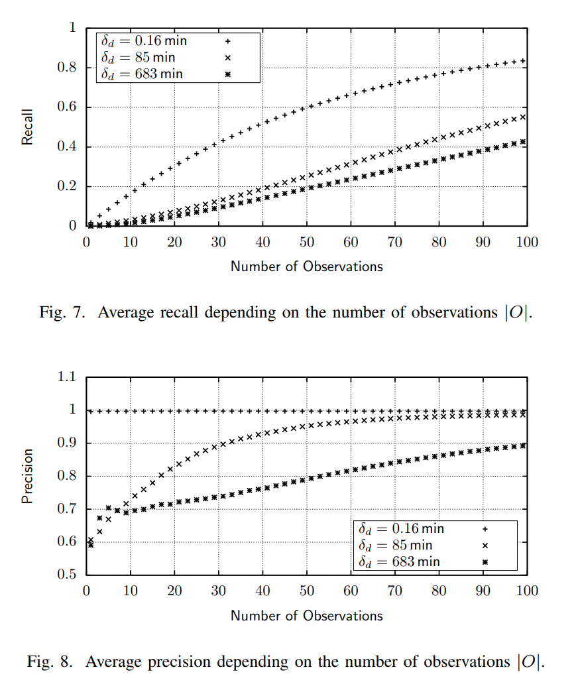

The best way to learn something is to teach it.
From now on, I will write summaries of noteworthy papers I read, talks I watch, etc.
That was one of the main purposes for starting this blog, after all.

Today's paper is "[Network layer aspects of permissionless blockchains](https://ieeexplore.ieee.org/document/8456488)" by [Till Neudecker](https://twitter.com/tillneu) and [Hannes Hartenstein](https://dsn.tm.kit.edu/english/staff_hartenstein.php) (Karlsruhe Institute of technology).

Blockchains[[^1]] reach consensus without identity management with up to 50% malicious actors (weighted by hash power).
To agree on something, peers need to know what they're trying to agree on.
Blockchains use a P2P protocol to propagate this data -- usually, transactions and blocks.

[^1]: "Blockchain" in the paper means permissionless blockchain.

Designing a network protocol implies optimization in a multi-dimensional space.
Obviously, we want data to propagate fast.
But do we want to sacrifice security (in a broad sense) for the sake of performance?
If so, to which extent?
How to quantify the trade-offs?


# Requirements and attacks

In Section IV (after introduction, related work, etc), the paper presents a survey of network-level attacks on blockchains and outlines relevant trade-offs in protocol design.

P2P networks existed before blockchain: consider file sharing (Gnutella) and anonymity overlays (Tor).
Blockchains have different requirements regarding information propagation (the paper does not specify how they differ, which is an interesting question to ponder).

The paper lists the desired properties of the protocol, dividing them into functional, non-functional, and security:

* openness (functional)
* dissemination of information (functional)
* performance (non-functional)
* low cost of participation (non-functional)
* DoS resistance (security)
* anonymity (security)

Many described attacks are based on the assumption that the adversary knows the network topology, so topology hiding is added to the mix as the third security requirement. [[^2]]

[^2]: For attacks aiming at inferring Bitcoin's topology, see "[Deanonymisation of clients in Bitcoin P2P network](https://arxiv.org/abs/1405.7418)" by Biryukov et al (2014) and, a more recent development, "[TxProbe: Discovering Bitcoin's Network Topology Using Orphan Transactions](https://arxiv.org/abs/1812.00942)" (2018) by Delgado-Segura et al.

There are two goals that an adversary may pursue:

* deanonymize users, that is, link network-level data (IP address) to application-level data (Bitcoin address);
* violate the security promises made by the application level:
	* "miners are rewarded proportional to their hash power" (selfish mining and friends);
	* "after N blocks, a transaction can be considered final" (double spend);
	* "the system is live if more than half the hash power is honest" (destructive attacks).

What can an adversary do to achieve these goals?
Broadly speaking, there are only two options:

* analyze the traffic;
* meddle with ~~elections~~ connections.


# Trade-offs

What trade-offs does an engineer face when designing a P2P protocol for a blockchain?
P2P network are defined by just two aspects: attachment strategy (who do I connect to?) and communicating strategy (which information do I transmit?).

## Attachment strategy

Imagine you launch Bitcoin Core for the first time.
How does it know whom to connect to?
One crazy way of figuring this out would be to establish connections to random IPs over TCP port 8333 and wait until you meet a Bitcoin node (good luck with IPv6).
A more practical albeit more centralized option is to hard-code bootstrap nodes into the software (_out-of-band_ peer discovery).
(Bitcoin uses a list of [hard-coded DNS records](https://github.com/bitcoin/bitcoin/blob/7275365c9bc7e7ebd6bbf7dcb251946aac44b5de/src/chainparams.cpp#L123) which resolve to well-known Bitcoin nodes).
Then a new node asks bootstrap nodes about other live peers they know (_in-band_ discovery).

Here are the trade-offs we face:

* If a node asks us for the IPs of nodes we know, how do we respond? Relaying dead addresses is wasting resources. The only way to know for sure whether a peer is alive is to connect to it. But if we only relay the addresses of peers we are currently connected to, we leak information about the network topology! (A simple attack: an adversary asks for peers we know, we reply with the full list of our current neighbors, the adversary DoSes them.) Therefore, we should relay a random subset of a list of peers which are _probably_ alive.
* How many outgoing connections do we establish? Too few -- and we are prone to eclipsing, too many -- and we limit the number of potential _clients_ (peers which do not accept incoming connections) in the network (clients consume others' connection slots but don't provide their own; Bitcoin has approximately [15 times more clients than servers](https://arxiv.org/abs/1709.06837): 150k vs [10k](https://bitnodes.earn.com/)). Bitcoin maintains 8 outgoing connections (default configuration).
* How many incoming connections we accept? If few -- clients are out of luck. Too many -- we overwhelm other nodes. Bitcoin allows for up to 117 incoming connections.
* Which topology do we use? Research shows that we can achieve many good properties by following a desired node degree distribution ([scale-free networks](https://en.wikipedia.org/wiki/Scale-free_network)). But in order to establish a non-trivial topology we must gather information about the actual, say, node degrees, which brings in centralization! Consider a simple example. Connecting to random IPs is suboptimal: being in Europe, why connect to Tokyo and San Francisco, when nodes in London and Frankfurt can relay the same data faster? We don't even need any central coordinator here, as [geo-IP databases](http://geoiplookup.net/) are common knowledge. On the other hand, relying exclusively on physically close peers decreases resiliency against a [fault in a trans-continental link](https://www.theverge.com/2018/4/8/17207556/submarine-internet-cable-mauritania-broken) or Chinese-firewall-style eclipse attacks.
* Do we discriminate against neighbors or treat them equally? Discrimination is optimization: let's query more data from a peer with a faster connection! On the other hand, performance-based discrimination requires performance data. We can get it by either measuring ourselves (introducing overhead) or relying on a third party or self-reporting (can be Sybil-attacked). Bitcoin uses some discrimination based on self-measurements, namely, nodes which violate the protocol get eventually banned. Tor uses trusted directory authorities to report the bandwidth of nodes.
* Do we maintain connections as long as possible (malicious nodes have a hard time connecting to us, but the topology is static and easier to infer), or deliberately disconnect and establish new connections at random intervals (fluid topology for better anonymity and performance overhead)?


## Communication strategy

There are trade-offs here as well:

* Do we treat all messages equally, or use meta-data to make decisions on message forwarding? Bitcoin treats transactions and blocks unequally: transactions are propagated with random delays to defer traffic analysis, whereas blocks are propagated as fast as possible to avoid giving well-connected miners an extra advantage (furthermore, specialized relay networks facilitate fast block propagation among miners).
* Do we push messages unconditionally, or announce a message ID and let neighbors request it if interested? Push is faster (one round time vs three) but more resource intensive. Bitcoin uses announce-and-pull (```INV``` -- ```GETDATA``` -- ```TX``` / ```BLOCK```).
* Do we relay to all neighbors (flood) or to a (randomly selected) subset (gossip)? Flood has a higher bandwidth cost, which nevertheless grows sub-linearly if combined with announce-and-pull (nodes which already have a transaction won't request it). This is the combination Bitcoin uses.
* Do we introduce artificial delays before relaying messages? Relaying as soon as possible reveals the "source of rumor" to a well-connected adversary; delays degrade performance.
* Do we accumulate messages and send them in batches, or send them one by one? Accumulation improves topology hiding but enables a new avenue for fingerprinting.


# Simulation-based approach

Section VI and VII of the paper take two design decisions and measure the effects of the trade-offs using a [simulation framework](https://github.com/tillneu/peerdiscovery-sim).

## In-band discovery

The authors analyze a basic in-band peer discovery strategy.
Each peer maintains a list of fresh peers (freshness is parameterized) and send a uniformly random subset from it to neighbors.
An adversary tries to discover the network topology: it connects to peers and listens to addresses they announce.
It then uses the maximum likelihood estimator to estimate the probability of two peers being connected.
An adversary is assumed to know all the model parameters and the parameters of the network, such as node degree distribution.
The adversary knows the a-priori probabilities of two peers being connected and of making a specific observation (receiving a list of addresses from a peer) conditional to the two peers being connected (this information can arguably be extracted from the source code and network measurements).

There is one parameter in the mode, &delta;, which shows how old an address in a local database can be.[[^3]]
The authors ran the simulation with three values of &delta;: 0.16 min (an extremely small value: we evict addresses after just a few seconds after disconnecting), 85 min, 683 min (another extreme: we keep addresses in our list for hours, despite the fact that they have likely died already).

The results are measured in terms of precision and recall.
An attacker assumes that some pairs of nodes are connected.
Precision shows which share on the assumed connections actually exist (true positives divided by {true positives plus false positives}).
Recall shows which share of true connections are in the attacker's estimated set (true positives divided by {true positives plus false negatives}).

[^3]: In the paper, this is &delta; with a subscript d, but I haven't learned how to do subscripts in Markdown yet. At least I can do footnotes!

The results are as follows.
Recall rises steadily in the number of observations, and smaller &delta; yields high recall values faster: if peer lists contain very few dead addresses, each observation gives attacker valuable insight.
Precision shows the same pattern, though a bit messed up at small number of observations.
Note that for an extremely small &delta;, precision is close to one from the very beginning (all connections assumed by the adversary are actual connections).

 

So, according to the graphs, 100 measurements is enough to infer the network topology with nearly 100% precision and 55% recall.
Should we panic already?
Not quite: as the authors mention in footnote 22[[^4]],

> Although some parameters were chosen in accordance with those in Bitcoin, our results are not directly applicable to the Bitcoin network because neither the discussed peer discovery strategy nor the network topology matches the ones in Bitcoin.

[^4]: Which is the de-facto standard place to discuss the real-world applicability of your research results.

## Relay delay

In Section VII, the same simulation approach is applied to measure the effects of another design decision in the networking protocol: relay delay.
In the proposed model, messages are relayed with a delay chosen according to a delay function (Bitcoin uses an exponential distribution).
An adversary sends messages to node S, measures the time until it gets it back from node T, and tries to estimate, based on maximum likelihood, the hop-distance between the nodes.
The results seem impressive but are, again, not directly applicable to the real world:

> All shown delay functions result in a recall of more than 95% for 20 observations. However, these values are a result of a strong adversary model with perfect knowledge of all network properties (e.g., latency, node degree distribution). Imperfect estimation of these properties causes a decline in inference quality.


# My conclusion

Having spent some time digging into the networking aspects of various cryptocurrencies, I'm glad to see a systematic review of trade-offs a protocol designer makes.

Looking at this complex, multi-dimensional field, I'm amazed again that Bitcoin (and other blockchains) work at all.

An interesting question is whether such findings can influence actual high-profile blockchain deployments (I'm mostly interested in Bitcoin).
Bitcoin Core is famous for its conservative development policy.
Take, for instance, DAG protocols a-la [GHOST](https://www.cs.huji.ac.il/~yoni_sompo/pubs/15/btc_scalability.pdf): they may be more effective than the naive Nakamoto consensus, but they have close to zero chance of being deployed in Bitcoin.
Zcash had to launch their own blockchain after their initial proposal -- Zerocoin -- [was not accepted by the Bitcoin community](https://en.wikipedia.org/wiki/Zerocoin_protocol).

Bitcoin is so change averse because its main asset is its predictability.
The fear of forks, [contentious](https://en.wikipedia.org/wiki/Bitcoin_Cash) or [accidental](https://freedom-to-tinker.com/2015/07/28/analyzing-the-2013-bitcoin-fork-centralized-decision-making-saved-the-day/), outweighs possible benefits of breaking changes.
That's why it's highly unlikely that consensus-layer changes will be implemented in Bitcoin.

But contrary to application-level modifications, network layer doesn't directly affect consensus and can be improved relatively easily.
For instance, the propagation randomization in Bitcoin was changed from trickling to diffusion in 2015 without controversy.
Consider [BIP156](https://github.com/bitcoin/bips/blob/master/bip-0156.mediawiki) (Dandelion).
It proposes a fundamental (though backward-compatible) change to Bitcoin's propagation mechanism for improved anonymity -- and I think it is much more likely to be deployed than say a new Script opcode (or a block size increase).

Today's paper, "[Network layer aspects of permissionless blockchains](https://ieeexplore.ieee.org/document/8456488)" by Neudecker and Hartenstein, makes developers of P2P protocols aware of the relevant trade-offs and helps them make design decisions in a scientific manner.
