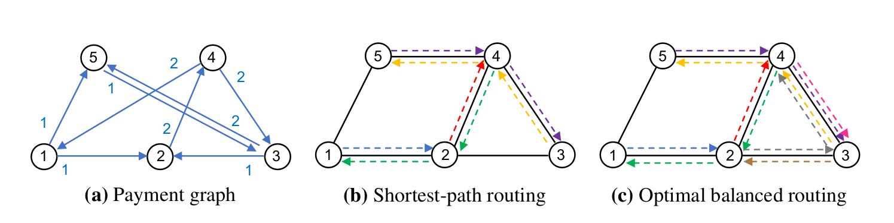
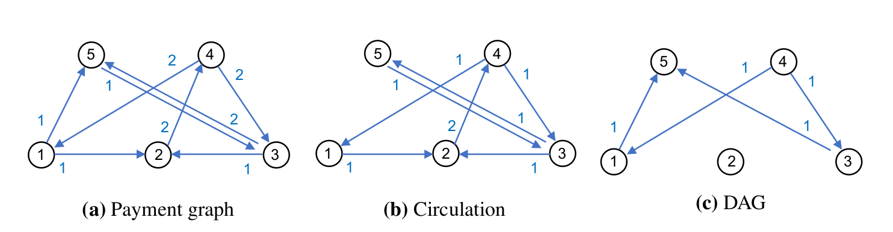
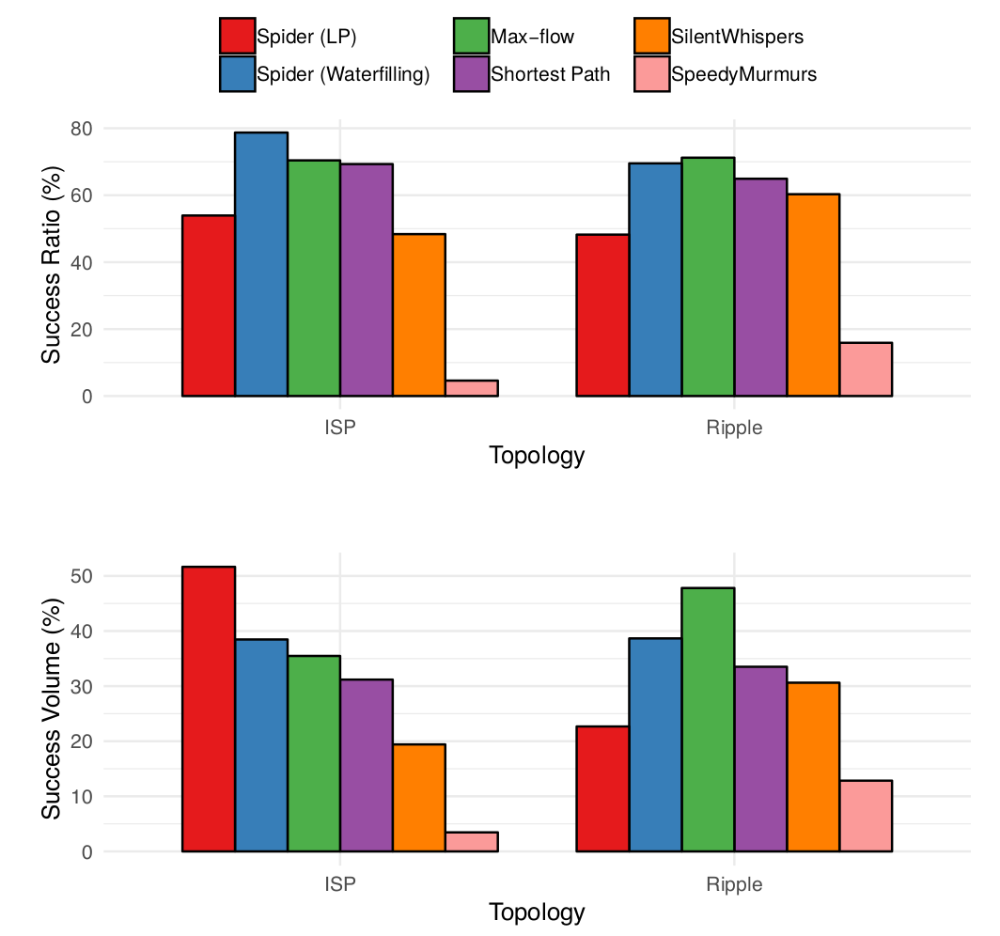

Let's continue our journey though recent paper which suggest ways to optimize routing in payment channel networks.
In previous posts, we looked an [SilentWhispers](/silentwhispers) and [SpeedyMurmurs](/speedymurmurs).
Both approaches emphasized privacy as an important goal, but employed different constructions: landmark-based routing (SW) and embedding-based routing (SM).
Today let's look into a paper entitled "[Routing cryptocurrency with the Spider network](https://arxiv.org/abs/1809.05088)" (2018) by Sivaraman et al.

# Introduction

I won't spend much time summarizing the introduction sections, as the points the authors underline are more or less the same in every paper in this area: blockchains are cool but not scalable, second-layer solutions are coming to the rescue, but how do we find paths?

The authors outline the existing approaches to routing in PCNs, listing all the usual suspects: the generic max-flow algorithm, Flare, SilientWhispers, and SpeedyMurmurs.
In all previous approaches, however, payment atomicity was considered "a red line": a payment must either go through or fail, tertium non datur.
The key idea of the authors is to weaken this requirement, and optimize for two separate variables: the success ratio (the share of transactions successfully processed) and the success volume (the total monetary value of the transactions successfully processed).
More concretely, the Spider routing algorithm

> actively accounts for the cost of channel imbalance by preferring routes that rebalance channels.

The authors identify the key challenge to continuous operation of PCNs: if a channel is consistently utilized in one direction more then in the other, it eventually gets depleted, and requires an on-chain transaction (with an on-chain fee) to continue operating.
To address the challenge, they introduce another approach to modeling the whole problem, which I find clever and insightful.

The authors also emphasize one crucial security assumption in PCNs, which is [often overlooked](https://medium.com/@peter_r/visualizing-htlcs-and-the-lightning-networks-dirty-little-secret-cb9b5773a0):

> the underlying cryptography backing payment channels assumes that transactions on the payment channels are larger than the blockchain transaction fee to ensure that broadcasting the true balance is profitable.

# Model

Previous approaches, such as SilentWhispers (SW) and SpeedyMurmurs (SM), operate under the paradigm of _periodic rebalancing_.
Nodes establish channels and start using them.
The network as a whole only knows the initial total channel balances.
As channels are being used, their capacity distributions deviate more and more from the initial state.
As a consequence, the share of payments failed due to insufficient capacity also rises.
To make the network useful again, rebalancing is required.
Rebalancing either happens once every epoch (SW), or "on-demand" (SM).
In both cases, this is a distinct process, separated from usual transaction routing.

The authors of Spider have a more ambitions vision: a payment network which doesn't need rebalancing at all!
Rebalancing in Spider, instead of being a separate process, happens naturally as payments are routed.

## An example

The usual way to model a PCN is a graph where nodes represent peers and edges represent channels (usually directed and weighted according to capacity).
Let's call it the network graph, as it represents the existing topology of the network.
The authors separate the two questions:

1. What is the current structure of the network? The answer is the _network_ graph.
1. How do the participants _want_ to use the network? The answer is the _payment_ graph.

The payment graph shows the intentions of the peers: how much value they collectively want to transfer in which directions.
Money flows are modeled not as individual atomic transactions, but as constant flows (which can be approximated with a series of _unit payments_).
The key question is, given a _topology_ graph **and** a _payment_ graph, how many payments can we satisfy?
Alternatively, given a payment graph, what is the optimal topology graph?
Or, given a topology graph, can we influence the payment graph using fees to make the network balanced?

Consider a fully connected network of 3 nodes: Alice, Bob, and Charlie.
Say, the initial state is three channels with capacities of 1 bitcoin on one side: Alice to Bob, Bob to Charlie, and Charlie to Alice.
Alice wants to transfer 1 bitcoin per day to Bob, Bob -- 1 bitcoin per day to Charlie, Charlie -- 1 bitcoin per day to Alice.
If every node chooses the shortest path, all 3 channels will be depleted after 1 day.
But if, instead, one of the "payment streams" is routed sub-optimally (Charlie -- Bob -- Alice instead of Charlie -- Alice), the flow of funds in one direction would offset that in the other, and the network would be able to run indefinitely (assuming zero fees).

The authors give a somewhat more elaborate "motivating example" in the beginning of Section 5 to illustrate this point:

 

The goal is to maintain the network in a "balanced" condition, that is, such that every node has equal incoming and outgoing value flows.
Let's define "balanced" transaction rate as the sum of flows through all nodes which can be maintained indefinitely.
Turns out, if every source node chooses the shortest path as a destination, the overall throughput wouldn't be optimal!
In a sample network of 5 nodes, they show how the "balanced" transaction rate is smaller than the maximum possible if all nodes choose optimal routes for their transactions (similar to my previous example with 3 nodes).

The authors than show that any payment graph can be decomposed into two components: the _circulation_ and the _DAG_.
These two graphs have the same nodes as the payment graph, but the weight of each edge is split between the two components (it may be zero in one of them).

 

All flows in circulation are balanced at every node (incoming and outgoing flows are equal).
All what's left goes into the DAG.
The authors show that for every payment graph there is a _maximum circulation graph_ (with the highest _transaction rate_), and for this circulation there is a network graph which achieves the maximum transaction rate.
The total throughput would depend only on the locked-up capacity compared to the "settlement delay" -- the time it takes for the receiver's secret to propagate to the routing node. Until that moment, the funds are "in flight" and can't be use for other transfers.
Consequently, no network graph achieves transaction rate higher than that of the circulation.

## Adding on-chain rebalancing

What happens if a payment channel does get depleted?

1. If I lack capacity on the local side (I want to send more), I can top up my side of the channel with an on-chain transactions (not sure this is currently implemented in Lightning, but this assumption is useful for modeling).
1. If I lack capacity on the remote side (I want to receive more), I can either spend some coins, or ask my counterparty to top up their side of the channel. Assuming there is no fiat world, and my counterparty is not particularly generous, I'm expected to reimburse them with, again, an on-chain transaction (see 1).

To reflect these options, the authors add the cost of on-chain rebalancing to the picture.
Putting all parts together (and accounting for the off-chain as well as on-chain fees), they come up with a system of equations which form a linear programming (LP) problem: our goal is to maximize the throughput given a set of constraints.
Solving the equations with the primal-dual algorithm, the authors derive the formula for the optimal fee structure that achieves the maximal transaction rate.
They also note that the used algorithm may converge too slowly if the network conditions are changing rapidly, and suggest a less precise but faster-converging alternative ("waterfilling").

#  Evaluation

The authors compare their approach (with both the LP and waterfilling algorithms) with alternatives: SW, SM, and max-flow.
The set of transaction from Ripple acts as a real-world dataset (as in the previous papers on the subject).

I'll come back to it later.

The first experiment compared the performance of the six algorithms (Spider LP, Spider Waterfilling, Max-flow, Shortest path, SW, and SM) for atomic payments only with two network topologies: [ISP-like](http://www.topology-zoo.org/) (not clear what it means exactly though) and a subset of Ripple.
See the results in the figure below; I'm surprised that SM performed so poorly and can't come up with a reason why (comments welcome!).

 

Note also that Spider only operates in benign conditions (i.e., in a permissioned network):

> [O]ur design does not address incentives <...>. It also doesn't account for adversarial routers relaying wrong values to the sender.

Isn't it the most important point?
How does Lightning handle it by the way?
Wouldn't be surprised if it also doesn't (looks exiting: so much space for research!).

# Conclusion and the road traffic analogy

The Spider network incorporates one of the key ideas from information networks (packet switching), which allowed the Internet to scale massively, to value networks.
This definitely looks promising.
But though the authors compare their approach to SW and SM, it still seems to me that they are answering different questions.

Citing the paper (page 12, Section 5.3, emphasis mine):

> To select paths, end-hosts monitor the total price **on different paths** and choose the cheapest option.

And in Section 6.1, describing the experimental setup:

> We restrict both algorithms to use **4 disjoint shortest paths** for every source-destination pair.

Well, but how do I get the list of these "different paths" / "disjoint shortest paths"?
Aren't we back at square one, in search for an efficient routing algorithm?

I think the following analogy might be useful.
Imagine a city suffering from road congestion.
People are commuting by car from home to work and back every day, and there is not enough road capacity.

Imagine an ideal situation:
* the city consists of two areas A and B;
* half of the population lives in A and works in B, and the other half lives in B and works in A
* the working hour are distributed equally throughout the day.

Under these rather unrealistic conditions, roads are equally occupied throughout the day.
But in reality, people mostly work in the city center and live outside it, work mostly during the day and sleep at night, so the flow is not balanced.

There are two related, but distinct questions:

1. For an individual: given all preconditions (the home address, the work address, the traffic conditions), how do I choose the best route?
1. For the city administration (or whoever owns the resources): how much do we charge for roads to balance supply and demand?

Max-flow, SW, and SM answer the first question.
What makes the task difficult is that the map of the city is too big for any individual to fully possess.
SilentWhispers find the shortest way to a highway (landmark), and from the highway (navigation on the highway is considered trivial).
SpeedyMurmurs, on the other hand, at every crossing turn to the direction which brings you closer to your destination.

Spider network seems to answer the second question: given a payment graph (where people want to go) and the network graph (road capacities), how much should entering each portion of a road cost so that equal amounts of traffic would go in the opposite directions?
If the most direct highway to my destination costs a lot, I'd be happy to take a detour via less congested roads.
If just the right share of commuters does so, the traffic will be balanced.
But is this even the right goal to strive for?
Shouldn't we aim for getting more people to their destinations using as little fuel as possible?
(Public transport, anyone?)

Maybe we're hitting the limits of usefulness of this analogy, but maybe we aren't.

