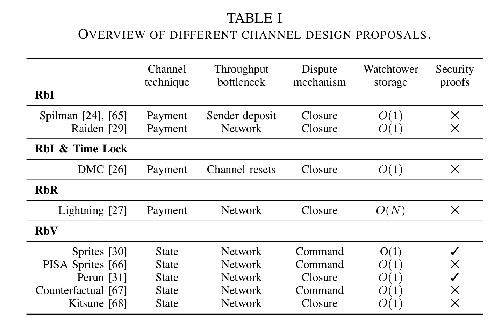
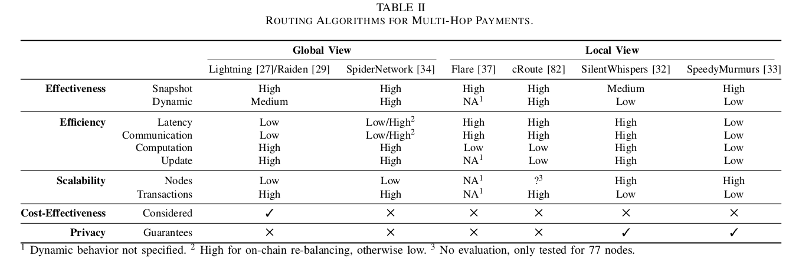

Here is papers I've been waiting for for quite a while.
Thinking about it, I'd be happy to have (co-)written it, had I directed my research into this topic a bit earlier.
Today's summary is based on a systematization of knowledge (SoK) paper by Lewis Gudgeon et al entitled "[SoK: Off the chain transactions](https://eprint.iacr.org/2019/360)".
The readers of this blog must be familiar with some of the challenges in layer-two protocols which I outlined in previous paper summaries.
But as in any rapidly developing field, information is dispersed across various media and is getting outdated quickly.
The authors summarize and systematize the challenges faced by the developers of layer-two protocols and compare the existing solutions.
I definitely gained at least some of the mental clarity essential for digging deeper and contributing to the field.
Read the whole thing to get general view of what problems are out there and how various proposals are tackling them.
And the 136 references will fill your "read later" folder with papers for months to come!

# Layers and myths

Blockchains scale poorly.
There are multiple approaches to improve the efficiency of the base layer (consensus algorithm).
But updating an existing blockchain is hard (if it's decentralized).
Layer-two protocols are a class of scaling solutions orthogonal to consensus improvements.
Their main feature is that they don't require any modifications on layer-one, taking it's security guarantees as assumptions.

The authors outline the four "myths" regarding layer two:
1. blockchains can't scale without advances in layer-one;
1. layer-two solutions are secure only if fully collateralized;
1. off-chain transactions are private by default;
1. blockchain transaction fees depend on transaction size or computational complexity, not its monetary value.

The very word "myth" calls for the verb "debunk", but this is not what will happen: rather, the authors provide insights regarding the "myths" throughout the paper.

What are these "layers" anyway?
The authors propose the following classification:
* hardware layer (layer "minus-one") account for the fact that hardware may provide "trusted execution environment" like Intel SGX (which shifts the security assumptions towards the hardware manufacturer and alleviates many problems of protocols designed to be run on general purpose hardware);
* layer-zero is the peer-to-peer network (though the paper focuses on permissionless networks, the authors point out that the insights regarding layer-two are also applicable to the permissioned ones);
* layer-one is the consensus algorithm;
* layer-two are protocols built on top of layer-one, of which the authors define three types.

What do we mean by "built on top"?

> Layer-two protocols typically assume two properties from the blockchain layer: integrity (i.e. only valid transactions are added to the ledger) and eventual synchronicity with an upper time bound (i.e. a valid transaction is eventually added to the ledger, before a critical timeout).

The authors separate layer-two protocols into two groups: channels (payment and state) and commit-chains.

# Channels

A channel is a type of a second-layer protocol where parties

> consent to state updates unanimously by exchanging authenticated state transitions off-chain.

There are two kinds of channels (though the division seems a bit artificial from the purely theoretical standpoint, though it does reflect the current reality): payment channels and state channels.

The workflow of a payment channel consists of three phases:

1. channel establishment: the parties lock up collateral on-chain;
1. channel transitions: the parties co-sign state updates and exchange them off-chain;
1. channel closure: the parties finalize the latest state on-chain (collaboratively or via a dispute mechanism).

The key design challenge for both payment and state channels is to prevent parties from submitting an outdated state to the blockchain.
There are four state replacement techniques:
* replace-by-incentive (RbI). In a one-way payment channel where Alice pays Bob, Bob will only submit the latest state to the blockchain because it will yield him the highest value. Clearly, it doesn't work with a bidirectional channel: if Bob pays back to Alice, he still possesses an outdated but valid state and can submit it to the blockchain effectively stealing from Alice.
* replace-by-timelock (RbT). In this scheme, each new update is timelocked (is valid only after a certain timestamp). Every new update must have the timelock closer to the present by a safe margin. This guarantees that the interested party will be able to submit the latest state to the blockchain before any outdated states are even valid. The drawback is that the lifetime of RbT is limited by the first timelock.
* replace-by-revocation (RbR). This is what Lightning is built upon. When agreeing on a new balance distribution in a channel, Alice and Bob effectively invalidate the previous state. If one of them tries to submit an outdated state to the blockchain, another party will be able to take the whole collateral. The drawback here is that parties are supposed to be constantly monitoring the blockchain.
* replace-by-version (RbV). This approach works best if the layer-one is stateful (like Ethereum). Each new state has an incrementing counter; the version with the highest counter value is valid (disputes can be settled by a smart contract).

The first three techniques are used in payment channels; the fourth one is the basic idea behind state channels.

## Payment vs state channels

The authors outline multiple proposed payment channel constructions, most of them are, in my opinion, only of a historical value.
The very first ideas for unidirectional channels date back to Satoshi himself, then there was a construction known as Spilman channels, then Decker and Wattenhofer proposed [Duplex micropayment channels](https://www.tik.ee.ethz.ch/file/716b955c130e6c703fac336ea17b1670/duplex-micropayment-channels.pdf)...
Eventually, the only implemented payment channel scheme is Lightning ([see part 1 of my series on it](/how-lightning-works)).
The authors point out the key drawbacks in the RbR-based Lightning construction:

> RbR is the first channel design to require both parties to remain online and fully synchronized with the blockchain to observe  malicious closure attempts. <...> RbR introduces unfavorable implications for third-party watching services <...> entails O(N) storage.

Can we improve this by using RbV in payment channels somehow? Decker et al propose

> Eltoo to support RbV in UTXO-based blockchains through the use of floating transactions

State channels generalized ideas pioneered by payment channels and apply similar construction to arbitrary computations.
The authors distinguish state channel constructions with _closure disputes_ and _command disputes_.
To be honest, I didn't understand this paragraph, as the notion of "installing / uninstalling" an on-chain application needs clarification.
The two most prominent constructions (at least those with formal security proofs) are [Perun](https://eprint.iacr.org/2017/635) (closure disputes) and [Sprites](https://arxiv.org/abs/1702.05812) (command disputes).

# Channel synchronization

Up to this point, we were only talking about single channels, but what about channel networks?
The authors suggest the term _channel synchronization_ to denote techniques to logically connect updates to multiple channels.
A well-known example are hash-time-locked contracts (HTLCs) used in Lightning: channels along the path get atomically rebalanced if the receiver reveals a hash preimage or a timeout expires.
Another approach, suited for stateful blockchains, is a global _preimage manager_ -- a smart contract which keeps track of the revealed preimages (see the Sprites paper).
The key advantage of the preimage manager is that it lowers the requirements for capital lockup from quadratic to linear in the number of hops (in the worst case).
In Lightning, the timelock at each next hop must be different from the previous one by a security margin to allow an intermediary node to confirm the correct balance on-chain in case of a dispute.
In a stateful blockchain with a preimage manager, the deadline can be the same for all channels in the path.
Other approaches to channel synchronization include _scriptless multi-hop locks_ (see "General state channel networks") and _virtual channels_.

# Routing

An important question in channel networks is how to find a path to the receiver capable of delivering the payment.
This tasks becomes tricky if we consider the resource limitations of end-user devices (smartphones) and privacy requirements (it would be bad to reveal all intermediate states in every channel, hence failures due to insufficient capacity are inevitable).

Shall we use onion routing for better privacy, one might suggest?
Here is a surprising insight:

> Some algorithms involve onion routing, which requires the random selection of nodes in a path to achieve its anonymity guarantees. As routing algorithms do not select the nodes randomly, it remains unclear if onion routing provides privacy in the context of payment channels.

Turns out, onion routing in Lightning may end up being just security theater?..
Mind = blown.
Looks like yet another issue stemming from the fundamental "information vs value" distinction.
Worth further investigation!

The authors define two approaches to routing: with global and local view.
Lightning and Raiden use source routing with global view: the sender is expected to have a full (potentially slightly outdated) snapshot of the network.
Local view routing algorithm fall into four categories: distributed hash tables ([Celer](https://www.celer.network/)'s cRoute), flow algorithms, landmark routing ([SilentWhispers](/silentwhispers), Flare), and network embeddings ([SpeedyMurmurs](/speedymurmurs)).
Another dimension to compare routing algorithms is along the _circuit switching_ (atomic payments) vs _packet switching_ (splitting a payment into smaller chunks and transferring them through different paths).
Routing for channel networks seems to be a very promising area of research, as

> no routing algorithm fulfills all desired criteria.

# Commit-chains

Commit chains are the second category of layer-two protocols, alongside channels.
In contrast to channels,

> commit-chains are maintained by one single party that acts as an intermediary for transactions.

The two proposals the authors review are [NOCUST](https://eprint.iacr.org/2018/642) (an account-based commit-chain) and Plasma (a UTXO-based commit-chain).
More specifically, they focus on Plasma Cash as the most mature Plasma flavor (I love [this video](https://youtu.be/suMDB34GXZ4) of Karl Floersch explaining it!).

The general  workflow for commit-chains is as follows.
An _operator_ collects commit-chain transactions and periodically _commits_ to the latest state.
There is no three-step lifecycle (open -- transact -- close) as in channels: the application is always on once launched.
Users can anytime withdraw their funds to the layer-one chain.

There are two ways for users to verify that their transactions are reflected correctly in the latest state commitment: Merkle proofs and zero-knowledge proofs.
The distinction is that Merkle root commitments "do not self-enforce", whereas

> ZKPs enforce consistent state transitions on-chain.

If I understood this correctly, we can theoretically encode the rules into the layer-one contract saying that the state transition is not valid unless accompanied by a zero-knowledge proof of its correctness.
On the other hand, I don't quite see how this can prevent censorship (an operator refusing to process chosen transactions as if they were not requested).

# Security and privacy

Layer-two protocols introduce new security / privacy challenges.
Despite a common belief, L2 transactions are not absolutely private by default (hardly anything is).
Sure, they are not permanently recorded in a globally replicated database for all chainalyses of the future to analyze.
But the privacy problem is far from solved.
Some of the relevant proposals mentioned in the paper are [TumbleBit](https://eprint.iacr.org/2016/575), [Bolt](https://eprint.iacr.org/2016/701) (the anonymous channels from the Zcash team, not the Lightning specification), and Rayo / Fulgor (this blog has a [summary of those](/concurrency-privacy-payment-channel-networks/)).

The listed security threats include:
* the requirement to keep keys in a hot wallet;
* the requirement to constantly be online;
* the problem of mass exits (bank runs for the new age -- everybody is trying to exit the malicious layer-two system, but the layer-one can't handle the load, timeouts expire, preventing honest dispute resolution);
* high cost of on-chain proof verification (650k gas on Ethereum for a single ZKP!);
* wormhole attack (two malicious nodes along the same path short-cut the preimage off the protocol, taking the fees from nodes between them);
* capital lock-up attack (start a payment but never reveal the preimage; all intermediary nodes pay the opportunity cost of locked channel capacities).

An interesting observation is the finality vs collateral trade-off between channels and commit-chains:

> Unlike previously discussed layer-two protocols, the intermediary commit-chain operator does not require on-chain collateral to securely route a payment <...> commit-chain transactions do not offer instant transaction finality (as in channels) but eventual finality after commit-chain transactions are recorded securely in an on-chain checkpoint.

The way I think about this is that in channels intermediary nodes provide _capacity_, therefore, they must lock it up.
The meaning of the phrase "Alice sent 1 coin to Bob via Charlie" is actually: Alice send 1 coin to Bob, _and_ Bob sent 1 coin to Charlie, with atomicity enabled by the protocol.
But Charlie must _have_ at least 1 coin to transfer to Bob while he waits to be able to pull 1 coin from Alice!
On the contrary, in commit-chains, user have to _trust_ the operator for all actions after the latest commitment.
Because of these additional trust assumptions, the system can operate _without collateral_: a Plasma operator implementing a payment service doesn't need to have any coins to be able to update its internal database and commit to the next state.
On the other hand, operators may optionally put up collateral which they would lose in case of fraud to boost users' confidence.
Moreover, by introducing some trust, we mitigate the mass exit problem:

> commit-chains do not require a deadline for users to withdraw their coins, mitigating the transaction fee bidding war.

This is possible because the operator doesn't hold any collateral which is locked in case of a dispute and must be unlocked eventually (hence timelocks)!

Another very interesting observation is that layer-two makes fees ~~great~~ dependent on the transaction _value_ again.
In traditional finance, it's common to charge fees as a percentage of the transaction value.
Bitcoin has a completely different model: transactions compete for space in blocks which is limited in terms of _bytes_, not coins.
Therefore, a common unit of account for Bitcoin transaction is satoshis per byte.
It costs about the same to transfer one dollar or a million dollars, if the transaction script has the same structure.
On the contrary, layer-two re-introduces the _value semantics_ into protocols: relaying a payment requires liquidity, and intermediary nodes pay more in opportunity costs of locked capital when transferring a million dollars as opposed to one dollar.
This suggests that the layer-two fee economics will look very different from layer-one (and we haven't fully explored the latter yet...).

# Conclusion

I highly recommend reading the whole paper (maybe multiple times, as it's quite dense).
There is just so much work to do in layer-two!
We have barely scratched the surface.
I hope to take part in this exploration soon.

