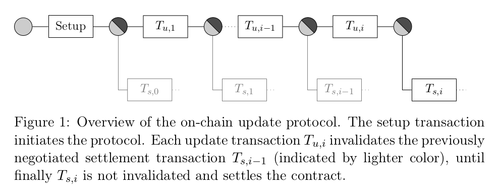

Continuing the journey through layer-two technologies, here is a summary of the paper "[eltoo: A Simple Layer2 Protocol for Bitcoin](https://blockstream.com/eltoo.pdf)" by Christian Decker et al (see also: [a summary in the Blockstream blog](https://blockstream.com/2018/04/30/en-eltoo-next-lightning/)).
Eltoo proposes a new construction for payment channels.[[^1]]
It is not a fully-fledged protocol, rather, it only describes one crucial building block -- state revocation mechanism.
As you might remember from [my summary](/sok-off-the-chain-transactions) of "[SoK: Off the chain transactions](https://eprint.iacr.org/2019/360)", the crucial challenge in L2 protocol design is old state invalidation.
Lightning uses replace by revocation (in the SoK paper terms) which works in practice but has its drawbacks.
The construction is rather complex, and the intermediate states held by the two parties are different.
This inherent asymmetry prevents easily extending the protocol to support multi-party channels.
Eltoo suggest another, symmetric state revocation mechanism, which is arguably better modulo one crucial limitation: it depends on a non-existent SIGHASH_NOINPUT signature flag.
The good news is, this change can be implemented relatively easily via a soft fork and doesn't seem to be very contentions.
If that happens, it would be possible to replace state revocation mechanism in the live Lightning network to Eltoo while preserving all other aspects (channel synchronization vis HTLCs, routing algorithms, etc).

[^1]: The authors seem to prefer stylized inscription "eltoo", in all small letters, but I prefer capitalizing proper nouns for easier reading, sorry.

# History: nSequense

It's worth noting that Satoshi himself tinkered the problem of re-negotiating a transaction without broadcasting it.
Bitcoin transactions have an _nSequence_ field, which was initially meant to act as a counter.
Miners were assumed to give priority to transactions with higher sequence numbers.
Honestly, it's hard for me to grasp how Satoshi, who invented the brilliant economic game that has been securing Bitcoin for over a decade now, seriously thought sequence numbers could work.
Miners as rational agents simply choose the transaction with the highest fee in case of a double-spend attempt. [[^2]]

[^2]: At least in the basic model without non-monetary incentives like a wish to harm Bitcoin for political reasons, or fees outside the protocol (also known as bribes).

In any case, miners even have some degree of plausible deniability: they may claim that they simply haven't heard of the transaction with a higher sequence number.[[^3]]

[^3]: Another aspect of the original Bitcoin design which makes me cringe is "send to IP" -- see [this LTB episode](https://letstalkbitcoin.com/blog/post/lets-talk-bitcoin-393-open-neutral-decentralized-borderless) where Andreas Antonopoulos explains why this is a very, very bad idea.

# Bitcoin scripts

Bitcoin is essentially a replicated state machine.
The _state_ here is the set of unspent transaction outputs (_UTXO set_).
Transactions modify this set by removing some outputs from the set ("consuming") and creating new ones.
Validity rules ensure that all transaction adhere to the same rules:
* the sum of output values is not greater than the sum of input values;
* the script executes to _true_.

On the protocol level, Bitcoin has no accounts and no balances, only scripts and transactions.
Bitcoin's scripting system is not particularly intuitive.[[^4]]
A transaction pends outputs by providing _input scripts_ which when concatenated with some unspent outputs evaluate to true.
Conditions under which bitcoins in the newly created outputs can be spent are described with _output scripts_.
A popular script template is "pay to public key hash" (P2PKH), which means "a valid signature corresponding to this public key".[[^5]]	

[^4]: Which may explain why Ethereum gained traction so quickly: it appealed to a large community of web developers who were not willing to dive into peculiarities of stack-based languages inspired by Forth.

[^5]: More precisely, to the public key hash -- the key is hashed to prevent certain privacy attacks and to add a layer of protection against the quantum threat: quantum computers may be able to derive a private key from the public key, but can't reverse hashes.

For example, for P2PKH the output script is "OP_DUP OP_HASH160 <Bob's Public Key Hash> OP_EQUALVERIFY OP_CHECKSIG".
The input script is "Bob's Signature> <Bob's Public Key>".[[^6]]
If you concatenate these scripts, imagine you're a stack machine, and execute the commands, you'll arrive at _true_, which means this input-output pair is legit ([Chapter 6 of Mastering Bitcoin](https://github.com/bitcoinbook/bitcoinbook/blob/develop/ch06.asciidoc) explains the process in detail).

[^6]: As the authors node, "due to this case being so common, the spending condition is commonly referred to as _scriptPubKey_, and the input script is referred to as _scriptSig_". Oh, I love how intuitive Bitcoin terminology is! Was it supposed to act as a filter against people without at least a Master's degree?

More complex conditions can be encoded with pay-to-script-hash (P2SH) outputs.
Here, the output only specifies the _hash_ of the script necessary to unlock the coins.
The spender provides the script, and the interpreter _first_ checks the hash, and _then_ executes the script.[[^7]]

[^7]: By the way, P2SH is recognized by the script format only. That is, if the interpreter sees a script in the form "check that the hash of the argument is equal to this", it _also_ interprets the argument itself as a script! Oh, how much engineering elegance! Wait till we get to timelocks, this will get _curiouser and curiouser_.

# Eltoo: on-chain version

The previous section was there just to give the necessary background.
Let's return at the task at hand: a secure L2 state replacement mechanism.
The authors first introduce an _on-chain_ version of Eltoo, where all intermediary states must be confirmed on-chain.
Then the authors "lift the protocol off the blockchain" and show how just with one little tweak to Bitcoin's transaction engine enables fully-fledged Eltoo.

Similar to Lightning network, Eltoo is a three-stage protocol consisting of a setup phase, a negotiating phase, and a settlement phase.
The setup phase consists of transferring some coins to a 2-of-2 multisig address. [[^8]]

[^8]: While the final protocol is extensible to more parties, the authors describe the 2-party version first.

Both Alice and Bob generate and exchange _two_ public-private key pairs: a settlement keypair and am update keypair.
Assume Alice funds the channel.
She creates a transaction spending her coins to a 2-of-2 multisig with either both update keys, or both settlement keys.
Before sending it to Bob, she requires him to sign a initial settlement transaction which spends the coins from the multisig back to Alice.[[^9]]

[^9]: Segwit enabled the ability to build protocols including spending not-yet-confirmed outputs, as their identifiers are not malleable anymore.

The funding output, as well as all successive update transaction outputs, can be spent in two ways (expressed as OP_IF branches in the script).
The first (true) branch is the settlement branch: it requires two signatures with _settlement_ keys **and** imposes a _relative_ timelock (i.e., is valid only after a certain number of blocks are created after the transaction which created the output was confirmed).
The second (false) branch is the update branch: it spends the output of the previous update transaction without any timelock.

Note the differences with Lightning:
* information held by parties is _symmetric_;
* parties use _different_ sets of keys for update and for settlement;
* a new update transaction spends the output of the _previous_ update transaction (whereas in Lightning all update transaction re-spend the same 2-of-2 output of the funding transaction).

The parties have the time until the timelock in the settlement branch expires to spend this output with a new update transaction (signed with their _update_ keys).

Consider Figure 1:

I should confess that I often have trouble wrapping my head around such diagrams, as the meaning of an edge if often defined implicitly.
Here a rectangle is a transaction, a circle is a script, a (transaction -- script) edge means "contains", and a (script -- transaction) edge means "spends".
Note the key insight: **many transactions can spend the same output**.
Of course, at most one of them is ever confirmed on-chain, but multiple valid transactions can spend the same (P2SH / P2WPKH) output (probably executing different branches of the script).
So the parties can co-sign _one_ transaction which spends a given output, exchange it without broadcasting it, and then co-sign _another_ transaction spending _the same_ output.
In fact this is exactly what they do: until the timeout in the settlement branch expires, they spend the latest output with a new update transaction.
If they want to close the channel, they either simply wait till the timeout expires and broadcast the latest settlement transaction, or co-sign a new update transaction and broadcast it immediately (cooperative close).

Here is how the update phase happens:

> The update transaction effectively doublespends the settlement transaction before it becomes valid. As with the funding transaction, before signing and broadcasting the new update transaction, the two endpoints negotiate a new settlement transaction that spends the newly created contract output.

Note that we are still dependent on on-chain confirmations of all intermediary update transactions!
So this is not an L2 protocol yet.
If only we had a way to preserve the security guarantees without broadcasting all intermediary update transactions...

# 3, 2, 1, lift-off!

That is exactly what the authors do in what they call "lifting the protocol off the chain".
Citing the [blog post](https://blockstream.com/2018/04/30/en-eltoo-next-lightning/),

>The key insight in eltoo is that we can skip intermediate updates, basically connecting the final update transaction to the contract creation.

But how is that even possible?
How can a transaction be valid if it doesn't specify exactly which outputs it spends?

## SIGHASH_NOINPUT

Bitcoin transaction includes the transaction hash and the output index of the outputs it spends.
Translated into English, a typical transaction looks like this:
* I'm spending output number 0 from transaction 0xdead, here is the input script;
* I'm spending output number 1 from transaction 0xbeef, here is the input script;
* I'm creating an output, here is the output script.

But what if a transaction didn't have to commit to the exact outputs it's spending?
In fact, it is possible:

> signatures in Bitcoin transactions can be parameterized with the sighash-flag that specifies which parts of the transaction are committed to in the signature. By introducing a new sighash flag, SIGHASH_NOINPUT, it is possible to selectively mark a transaction as a floating transaction.

(A transaction is called _floating_ if it "can be bound to any previous transaction with matching scripts".)

Let's visualize an output as a secure vault.
A transaction opens a vault and re-distributes the money to other vaults.
A vault says: "whoever has the key can open me and do whatever they want with the content".
A usual transaction says: "I have the key from **this** vault, so I'm opening it (and distributing the content into other vaults)".
A SIGHASH_NOINPUT transaction says: "I have a key, but I don't yet know which vault I will open with it -- might be **any** vault where the key works".
Hence, the _same_ update transaction, once signed, can be _modified_ to _attach_ it to the required settlement transaction.

Is that all?
Not quite...

## Ordering

As the authors point out,

> Using the SIGHASH_NOINPUT flag for update transaction adds a lot of flexibility, however they are now too flexible.

In particular, the current scheme allows replacing a new update transaction with an older one.
This unfortunate circumstance is explained by the fact that we completely discarded any notion of order.
Without committing to outputs, any update transaction can be attached to any other update transaction.
But this is not what we wanted:

> by using SIGHASH_NOINPUT we have removed any commitment to the state we are replacing. We therefore have to selectively re-introduce some of the previous transaction’s details into the validation.

Timelocks come to the rescue (again).

To check for timelocks, Bitcoin has two opcodes with totally intuitive names: OP_CHECKSEQUENCEVERIFY (aka OP_CSV) and OP_CHECKTIMELOCKVERIFY (aka OP_CTLV).
The former one is _relative_, and the latter one is _absolute_.
Eltoo uses absolute timelocks to order update transactions.
Currently, OP_CSV ensures that the current time is later than the one encoded in the output.
There are two ways to define absolute timelocks: as blockchain height, or as a UNIX timestamp.
In yet another example of technical elegance, Bitcoin uses the same field for these two cases.
The semantics is determined by the value of the field.
The current timestamp, at the time of writing, is around 1.5 billion (1 billion seconds is approximately 32 years).
The current block height at the time of this writing is a bit over 573 thousand.
So if the value in the nLocktime field is above 0.5 billion it is _interpreted_ as a timestamp, otherwise as a block height (note: billion with a b, that is, Bitcoin can exist for another 10 thousand years until timelocks are broken).

Just if that wasn't enough of a dirty hack, the authors suggest the following.
There are around 1 billion (and counting!) timestamps between 0.5 billion and [the current moment](https://www.unixtimestamp.com/).
All these timestamps are in the past, so absolute timelocks are irrelevant for them.
"I define this transaction to only be valid after 15:43 UTC on 8 October 1997" -- well, it _is_ already valid.
Therefore, we can repurpose the poor nLocktime field once more and assign the values in the 0.5 billion -- 1.5 billion range the semantics of Eltoo state counters. [[^10]]

[^10]: Reminds me of [this post](http://hackingdistributed.com/2016/04/05/how-software-gets-bloated/) by Emin Gün Sirer on "clever" hacks in multi-layered protocols and the following software bloat...

Anyway, just assigning some semantics to some field doesn't make it enforceable (just as was the case with nSequence).
The authors suggest a workaround:

> In order to achieve the limited binding for settlement transaction a new set of public keys A s,i and B s,i is derived that is specific to each state number. The key-pair derivation can easily be done with hierarchical deterministic key derivation as used by many existing Bitcoin wallets. This ensures that a settlement transaction can only be bound to the matching update transaction.

The paper more fine-grained details on the compatibility with P2SH and P2WSH transactions and on fees, but the general construction can be summarized as follows: parties update the state using floating update transactions, which double-spend the output of the previous update transaction before the corresponding settlement transaction is valid.

# Eltoo vs Lightning

## Structure of intermediary transactions

The Eltoo authors put an emphasis on the symmetric nature of their protocol.
Thinking about it a bit, I came to realize the fundamental distinction between Eltoo and Lightning revocation protocols.

Lightning transactions re-spend the same output (of the funding transaction) again and again.
To prevent an old state from being confirmed, the _toxic_ information is used: if Alice broadcasts an old state, Bob has the revocation key allowing him to take all the money from the channel.
In Eltoo, on the contrary, intermediary transactions are organized _linearly_.
The first update transaction spends the output from the funding transaction, and the settlement transaction spends the output of the latest update transaction.
We don't need toxic information anymore, because transaction are (temporarily) linked linearly.
Only when the channel closes, the latest update transaction is bound to the initial funding output.
This allows for the symmetry of the information held by the parties.

Note that in Eltoo, as well as in Lightning, the victim must be online to present a "double-spending" update transaction if an old settlement transaction is broadcast.
And, similarly to Lightning, only payments larger than the L1 fee are economically secure.

## The cost of timelocks

In Eltoo, the settlement part of every output script is time-locked.
The authors acknowledge the related trade-off:

> Notice that choosing the correct timeout for the settlement branch is a trade-off. It must be chosen high enough to guarantee that any subsequent update is confirmed before the settlement transaction becomes valid. On the other hand this timeout is also the time participants have to wait before funds are returned to their sole control should the other participant stop cooperating.

In my opinion, this is the biggest drawback of Eltoo: a channel expires after some time if both parties do nothing.
Of course, if both parties are cooperative and want to maintain the channel, they just won't broadcast the now-valid settlement transaction, but this can not be guaranteed.
Lightning, on the other hand, maintains the state of a channel indefinitely: both parties can go offline, return in a year, and continue updating the channel.
Does this lead to inapplicability of Eltoo in any of the Lightning use cases, or vice versa?
If state revocation technique is just a replaceable module in a larger L2 protocol, can we envision a future where we have multiple implementations of all L2 building blocks (networking, routing, state invalidation...) and can combine them to better suit our particular set of constraints?..

# Conclusion

Eltoo is a cleverly designed protocol.
I'm looking forward to the [SIGHASH_NOINPUT BIP](https://github.com/bitcoin/bips/blob/master/bip-0118.mediawiki) being discussed and hopefully implemented, enabling Eltoo implementation.

Eltoo and SIGHASH_NOINUT is an interesting example of blockchain protocol design evolution.
As far as I can tell, the initial code published by Satoshi was not of enterprise quality.
It took years of engineering effort to separate it logically (wallet stuff from networking stuff from consensus stuff) and fix bugs.
But also on a higher level, Bitcoin initially was probably too "strict".
For example, transactions must commit to outputs they are spending.
How could it be otherwise?
Seems logical, until someone explores the protocol deeply enough to realize that we can remove this restriction and enable new functionality without sacrificing exiting security guarantees.
Segwit is another improvement of this kind.
What else can we strip from the protocol to enable new use cases without weakening the security model?

Another lesson from reading about Bitcoin scripts is that Bitcoin is full of dirty hacks.
I understand the desire of some talented teams in the space to take the brilliant idea by Nakamoto, derive a new system based on it, and implement it cleanly from scratch (e.g., Cardano with its heavy emphasis on formal verification).
For what it's worth, I have a feeling that Bitcoin's network effects are already so strong, that it would be really hard to compete with it in its niche, despite all its inefficiencies.
The question is, what are other niches for blockchains, apart from digital money?