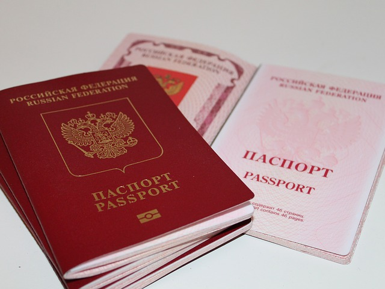

[European parliamentary elections](https://en.wikipedia.org/wiki/2019_European_Parliament_election) are happening right now.
Streets of the EU are full of posters promoting parties and candidates.
I thought it's a suitable time to share my thoughts on one particular policy area.
Inequality and discrimination are trendy topics.
Restricting someone's freedoms because of the color of their skin sounds so absurd (to me at least) that it's a somewhat easy target.
I'd like to point out though, that there is another major source of unjust discrimination which few people talk about -- citizenship.

 

You are randomly born into one of the existing 200 countries in the world.
You are given a piece of paper which confirms that you are you (a questionable arrangement in itself, but we'll leave identity questions for the next time).
You quickly notice that some countries are better than others (from your subjective viewpoint).
Maybe you are looking for better employment opportunities, or a more suitable climate, or whatever your reasons may be.
Turns out you can't simply move!

If you're lucky enough to be born, say, French, and want to move to Germany, you will only face some minor inconveniences (like, register once on arrival).
But if you're a "third country" citizen (the common EU term for countries other than the EU itself and a few other countries with corresponding agreements signed), you have to _convince_ the authorities that you're _worth_ living in their country.
Isn't it inherently inhumane?
I haven't committed any crimes, I just want to live and work in your country, and you deny me entrance because... reasons?
Like, my country is not as politically stable as yours?
(Guess what, that's why I'm moving!)
Presumption of innocence, anyone?
I'm in fact punished for the actions of my government, which I have no control over, as it's not a democracy.

I'm not talking about tourist visas: that process seems to be generally improving as countries compete for tourist dollars.
Though if you're a Russian citizen and want to go to the US, you'll [have to](https://www.kommersant.ru/doc/3753760) _fly to another country_ to apply for a visa, because the US and Russia decreased the numbers of diplomatic personnel due to worsening relations a couple of years ago.
(You technically _can_ try to schedule an appointment in Russia, but you'll have to wait many months even if you succeed.)
Like, WTF?
I just want to take a selfie in front of the Statue of Liberty, and you're telling me that I'll have to apply in Tbilisi or Riga (if I have _another_, Schengen visa) because certain shady Russian figures bought some Facebook ads in 2016?

Open borders is one of the reasons the EU's appeal attracts to me.
(I know the EU and Schengen area [are different things](https://www.youtube.com/watch?v=O37yJBFRrfg), but I'll keep things simple for the sake of argument.)
Let's just agree everyone may live and work wherever they want!
Sounds nearly too good to be true, but only if you're already born into an EU citizenship.
If you're not, and want to obtain one, you'll have to make trade-offs.

# Naturalization in the EU

Each EU country has its own policy of naturalization.
Just look at [this beautiful table](https://en.wikipedia.org/wiki/Citizenship_of_the_European_Union) compiled by Wikipedia editors.
There are at least two conditions a wanna-be citizen usually must satisfy: living in a country lawfully for N years, and knowing the official language at a certain level.
The problem is, the policies are not unified!

First, the terms.
As far as I understand, the purpose of this policy is to ensure that a candidate can live in the country lawfully for a substantial term.
But why is it so important where exactly did I lawfully reside?
Why does not, say, Germany recognize the years spent in France as a proof that one would be a law abiding German citizen?
They have no problem recognizing a university diploma.
Though _after_ you get a French passport, you can live in Germany and no one would care.
Isn't it absurd?

Second, the language.
The EU is famous for [its multilingualism](https://en.wikipedia.org/wiki/Languages_of_the_European_Union).
Each country wants to ensure that the new citizen would be able to communicate with the government officials and local population.
Sounds reasonable, right?
But, again, a French citizen with no knowledge of German can move to Germany without any problems!
As my experience shows, you can get along quite well using English only in many European cities.
Denmark, Sweden, and the Netherlands are especially famous for English proficiency.
In any case, language knowledge (or lack thereof) is my personal problem!
If needed, I will learn the language, or use Google Translate, or hire a translator, whatever.
Why do you make me learn the language before I even need it?

Then, there are issues of allowing or disallowing multiple citizenships, which also seem deeply unethical to me.
If I fulfill all obligations as a citizen of country A, why does this country care which other obligations I have?

If I had a pan-European political party, my central policy would be simplifying and harmonizing citizenship laws.
Ideally, to obtain an EU citizenship, a candidate would have to:

1. Live lawfully in _any_ EU country for, say, 1 year;
1. Prove basic knowledge of an official language of _any_ EU country (English included: even after Brexit, it remains (co-)official in Ireland, Malta, and Cyprus).

I could even envision a _generic_ EU citizenship, without a country specified.
With such a passport, one could live in any EU member state, and pay taxes depending on permanent residence (or whatever rules EU citizens currently follow).
This could also be combine with a citizenship by investment program with radically lower fees than 6-7 figure sums charged now by around 20 countries globally.
Of course, you may ask, how would I sell this disruptive policy to voters, many of whom benefit from the status quo?
A hard question indeed, but one line of reasoning could be making the point that everyone would win economically from high-skilled (innovation etc) as well as low-skilled labor (low prices for taxi rides and food delivery), and even if your share of the economic pie decreases, the pie itself would be bigger...

# Citizenship in the 21 century

Citizenship used to be tightly connected to identity.
Very few people ever though of acquiring another one.
In the modern global, digital world, a passport is somewhat like a club membership that just lets you do your business without headaches.
A piece of paper that grants you the privilege to avoid constantly proving that you are worth just _being_ on a certain territory.

The EU is built upon a strong humanistic ideological basis.
Compared to the US, which emphasize personal freedom, Europe is more about guaranteeing equal opportunities and at least minimal living conditions for all.
There is only one step to _real_ humanism as I understand it: the entitlement to equal economic opportunity applies not only to people lucky enough to randomly be born on a certain territory, but to _all people_.
Someone born in Russia, China, or Nigeria has an equal right to "the pursuit of happiness" in any part of the world, as does someone from Germany or France (or the US, or Australia, for that matter).

And I haven't even mentioned the enormous economic benefits obtainable by just _letting people work where they want to_.
As further reading, let me suggest this text by The Economist: [A world of free movement would be $78 trillion richer](https://www.economist.com/the-world-if/2017/07/13/a-world-of-free-movement-would-be-78-trillion-richer).
If you speak Russian, you can also watch [this interview](https://www.youtube.com/watch?v=cwy2OGQ6sng&feature=youtu.be&t=613) (time-coded to the pro-immigrant argument I totally support).

I really hope to see developed nations adopt more permissive immigration policies, be that for ideological or economical reasons.

P.S. That is not to say that totally open borders would bring only benefits (though I believe the overall balance would be positive).
And I'm not talking about locals [losing their jobs](https://www.youtube.com/watch?v=toL1tXrLA1c) which they only had because of protectionist policies of their government.
A very interesting question to ponder is whether free migration will lead to everyone moving into a handful of the most economically developed cities and whether and to which extent that would degrade the quality of living there...

