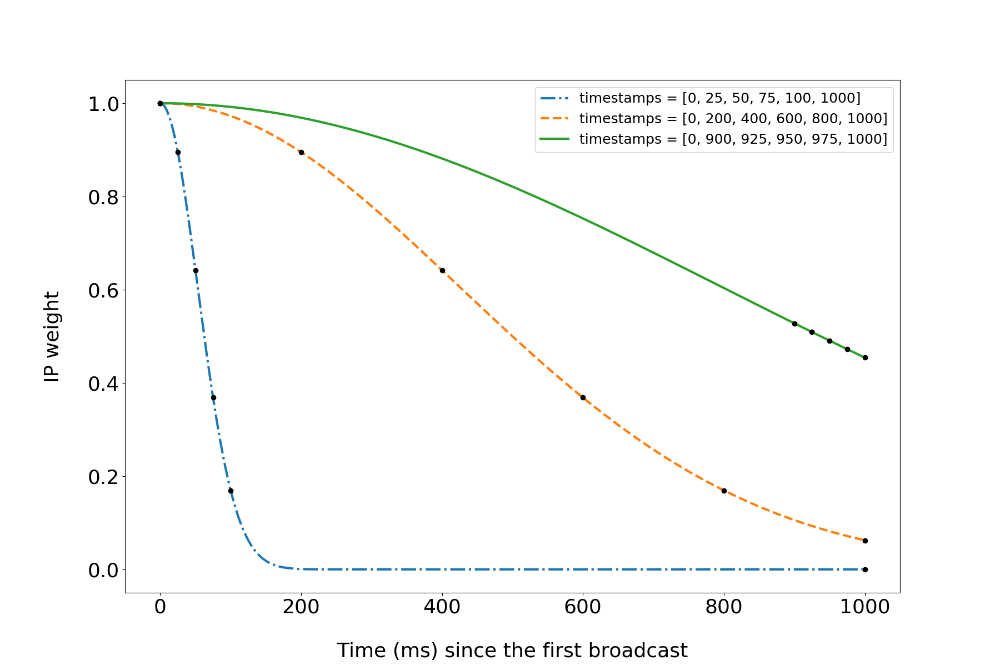

For the significant portion of 2018, as part of my PhD studies in [CryptoLUX](https://www.cryptolux.org/) group at the [University of Luxembourg](https://wwwen.uni.lu/), I've been working on network-level privacy attack on Bitcoin and other cryptocurrencies with professor Alex Biryukov.
This blog post summarizes our findings, which have been published in 2019 ("[Deanonymization and linkability of cryptocurrency transactions based on network analysis](http://hdl.handle.net/10993/39724)").
You can watch my presentation at EuroS&P 2019 in Stockholm (press CC for subtitles; [slides](https://orbilu.uni.lu/bitstream/10993/39724/2/biryukov-tikhomirov-deanonymization-and-linkability-slides.pdf) are also available):
<iframe width="560" height="315" src="https://www.youtube-nocookie.com/embed/XXO3FBqwwO8" frameborder="0" allow="encrypted-media" allowfullscreen></iframe>
You though it was enough to use mixers or privacy-focused altcoins to preserve the privacy of your cryptocurrency transactions?
Think again...

# Privacy in cryptocurrencies

Bitcoin is the first successful implementation of decentralized digital money.
Its key innovation is using proof-of-work to make modifying the ledger difficult.
But in order to be really decentralized, Bitcoin and other cryptocurrencies must provide at least some level of privacy.
Otherwise, those in power would still have some influence over cryptocurrency users.

Unlike a bank account, generating a Bitcoin address doesn't require having passport.
You can, and are in fact advised to, generate a new address for every transaction.
This doesn't guarantee full privacy though.

The fundamental trade-off here is between privacy and verifiability.
Bitcoin tries to be decentralized: users must be able to independently validate incoming transactions.
But to be able to _verify_ incoming bitcoins, I must know _where they are coming from_.

Bitcoin transactions, once included in a block, are stored on thousands of nodes worldwide.
Anyone can download the whole Bitcoin transaction history and analyze it.
Turns out, there are techniques to extract quite a bit of information from the blockchain.

A Bitcoin transaction _consumes_ (spends) a number of unspent transaction outputs (UTXOs) and creates new UTXOs.
One heuristic is that all UTXOs in a transaction belong to the same entity.
This is not generally true due to multisigs etc, but good enough for a heuristic.
Another heuristic is that one of the outputs is the _change_ address.
Just as with cash, you usually don't pay the exact amount, but pay a bit extra and receive change back.
Multiple papers have been published along those ideas, and there are commercial companies which offer services of deanonymizing cryptocurrency users.

Alternative cryptocurrencies aim at stronger privacy.
More established ones include Monero, Zcash, and (to a lesser degree) Dash.
Newer ones, Beam and Grin, are based on the MimbleWimle protocol.
They do indeed prevent or at least hinder blockchain analysis.
While flaws have been described in all of them, one cannot simply open a blockchain explorer and look where certain coins come from.

The information stored on the blockchain is stored there forever.
But what about the ephemeral information in the peer-to-peer network?
Can an attacker extract any useful deanonymizing data from observing the network traffic?
What makes the idea even more interesting is that privacy focused cryptocurrencies use P2P networks similar to Bitcoin...

# Randomization of transaction propagation

Cryptocurrencies rely on peer-to-peer networks to propagate data.
In particular, a Bitcoin node connects to 8 random nodes (and may accept incoming connections) and relays transactions to them.
They, in turn, relay it to their neighbors, and so on.
After a few seconds, nearly all nodes become aware of the new transaction, and miners can include it in a block.

If Alice knows a new transaction, she first announces its hash in an inventory (INV) message to Bob.
Then only if Bob is interested in this transaction he replies with a GETDATA message, and Alice replies with a TX message for a transaction.
If this gossiping mechanism was implemented just naively, it would be dangerous for privacy: an adversary could listen to the network and try to estimate the "rumor source".
That's why there are certain _broadcast randomization_ techniques used in Bitcoin and other cryptocurrencies: trickling and diffusion.

Trickling was used in Bitcoin before 2015 and is still used in Zcash.
In trickling, a node chooses a random neighbor subset and announces the transaction only to them.
Then, after a certain delay, another random subset is chosen, and the transaction is announced to its members.
In diffusion, for each neighbor, a node announces the transaction to each neighbor after a random delay.
As we will show, these methods hinder but do not completely eliminate network analysis.

# Transaction clustering based on network-level information

The general idea behind our attack is to connect to many nodes and log the timestamps of transaction announcements.
The intuition is that transactions which originate from the same node propagate in a _similar_ fashion.
(We will define the notion of similarity later.)
First, we have to overcome some technical difficulties to collect the data.

## Parallel connections

As described earlier, Bitcoin uses a mechanism known as diffusion to  network-level attacks on privacy difficult.
If we collect data by only connecting to each node once, as the reference software allows us to do, we won't gain much.
Ideally, we want to be the first to receive a new transaction announcement from the peer which generated it.

A typical full node maintains 8 outgoing and allows up to 117 incoming connections.
Say, it has 12 incoming connections, for a total of 20 connections.
This means that if we connect to it, we have only a 1 in 20 chance of being the first to hear about a new transaction.

To overcome broadcast randomization, we use an alternative implementation of the Bitcoin networking stack called [bcclient](https://github.com/ivanpustogarov/bcclient).
It was developed here at [CryptoLUX](https://www.cryptolux.org/index.php/Home) as part of the research resulting in "[Bitcoin over Tor isn’t a good Idea](https://arxiv.org/abs/1410.6079)" and "[Deanonymisation of Clients in Bitcoin P2P Network](https://arxiv.org/abs/1405.7418)".
Bcclient connects to Bitcoin nodes with multiple _parallel_ connections.
As Zcash inherited most of networking properties of Bitcoin, it was relatively straightforward to adapt bcclient for Zcash.

## Weighting IP addresses

Next, we want to find a metric to compare transactions.
Each transaction can be characterized by a vector of IP addresses which announced it to us.
For each transaction, we consider a _vector_ of IP addresses which were the the first to announce it to us, assign _weights_ to them.

Intuitively, the first IP to announce the transaction to us is the most likely to be the sender.
For each subsequent IP, the probability of it being "close" to the sender decreases.
In real network some transactions get to us very quickly, some of them get to us a little bit slower.
For every transaction, we want the weight of IP addresses to drop neither too quickly nor too slowly.
Here is an example of weights assigned to three (made up) timestamp vectors by our parameterized weight function (see the paper for details):

## Calculating correlations

Next, we calculate the correlation coefficient for each pair of weight vectors and depict them as a matrix.
We expect it to exhibit a special structure: with the right permutation of rows and columns, clusters would be visible along the main diagonal.
That would mean that some subsets of transactions are closer related to each other than to other transactions.

To measure the effect of our attack, we use the [anonymity degree](https://en.wikipedia.org/wiki/Degree_of_anonymity) proposed by Diaz et al in 2002.
This metric, originally introduced for messaging systems, reflects the amount of information that the attacker can obtain regarding who was the author of each message.
The anonymity degree varies from 0 to 1, where one means perfect anonymity, and zero means no anonymity at all.

## Recap: what we do step by step

We connect to many nodes from servers on three continents (Europe, Asia, and North America) to get a better view of the network.
We log transaction announcements and assign weights to vectors of timestamps for each IP address.
Then we calculate the pairwise correlations between these weight vectors and apply the spectral co-clustering algorithm, which tries to find the permutation of rows and columns in the matrix such that the internal clustering structure would be visible.
It is [implemented](https://scikit-learn.org/stable/modules/biclustering.html#biclustering) in a popular Python sklearn library.
Then we calculate the anonymity degree using our own transactions as ground truth.

# Results

On the Bitcoin testnet, we did the full-scale experiment connecting to all nodes with as many connections as possible.
We obtained the following picture (see the paper for full results):

We clearly see that our own transactions (marked with black lines) form a cluster, and we see some other clusters forming along the main diagonal.
We also did the experiment on the Bitcoin mainnet, but in order not to disrupt the real network, we limited ourselves to only connecting to 1,000 nodes, which is about 1/10 of the nodes available, and didn't try to occupy all connection slots.
The results on mainnet are significantly worse: our transactions are scattered around the clusters.

We also did an experiment on Zcash, and there the picture is not that clear, but still our transactions form a cluster.
It's also important to note that in Zcash transactions can be shielded or transparent.
Transparent transactions have the same structure as in Bitcoin and give no privacy enhancements.
Shielded transactions take advantage of sophisticated cryptography (zk-SNARKs).
In the following picture, the longer black lines indicate the shielded transactions, and shorter ones indicate transparent transactions.
This shows that our method doesn't care whether you use zk-SNARKs or not because we only take transaction hashes into account:

The traffic for Dash and Monero also exhibits some cluster properties (see the paper for the full results).

We also estimated the original sender IP address for a given cluster.
It is only possible in certain circumstances.
When a node connects to a network, it advertises its IP address in an ADDR message.
If our listener nodes are online at that moment, they can compare the IP address announcement in the address message with the IP addresses which are highly ranked in certain clusters.
We show that, at least for the Bitcoin testnet, an adversary can narrow down the search of the source IP address to about five IP addresses.

What about countermeasures?
From a cryptocurrency user's point of view, you shouldn't issue many transactions during the same session.
If you do, you may want to run your nodes with an increased number of connections and also periodically drop and re-establish connections.

Two recent proposals in Bitcoin, [Dandelion++](https://arxiv.org/abs/1805.11060) and [Erlay](https://arxiv.org/abs/1905.10518), would defeat our attack if implemented.
In both cases, the key change compared to the existing P2P protocol is that the first stage of propagation is performed with outbound connections only.
This ensures that an adversary has a zero probability of receiving a new transaction announcement early, if the victim did not choose to connect to the adversarial IP.
This probability can not be increased by establishing _incoming_ connections, as we have done in this work.
Note that the Erlay paper explicitly states: "The decision to relay through outbound connections, but not the inbound ones, was made to defend against timing attacks".

# Conclusion

Many blockchain developers think of the network layer as a black box: it broadcasts transactions, what else do we need?
As we have demonstrated, timing of transaction announcements reveals information on related transactions.
This data is invisible on the application level.
Randomization techniques, as they exist today, are not 100% efficient.
The issue is especially crucial for privacy focused cryptocurrencies.
Novel P2P protocols may help alleviate the attack by preferring outbound connections for the initial announcement phase.

See the full papers for more details:

* [Deanonymization and linkability of cryptocurrency transactions based on network analysis](http://hdl.handle.net/10993/39724) (IEEE EuroS&P 2019)
* [Transaction Clustering Using Network Traffic Analysis for Bitcoin and Derived Blockchains](http://hdl.handle.net/10993/39728) (CryBlock workshop at IEEE INFOCOM 2019) -- a shorter version of "Deanonymization and linkability"
* [Security and Privacy of Mobile Wallet Users in Bitcoin, Dash, Monero, and Zcash](http://hdl.handle.net/10993/39729) (in a special issue of "Pervasive and Mobile Computing" on blockchain technologies) -- studying the networking aspects of mobile wallets and applying the clustering technique to transactions issued from smartphones.
