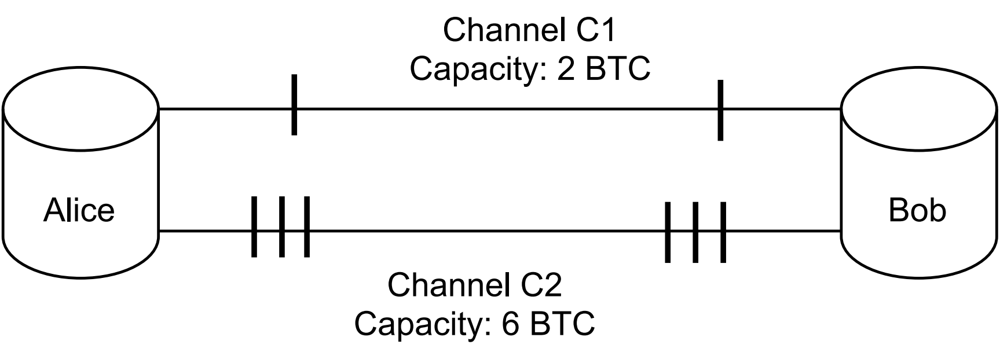
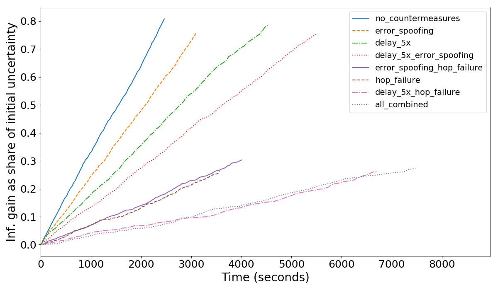

**This post is kept here for archival purposes. It is superseded by [this later post](/lightning-probing-2/).**

The Lightning Network (LN) is a prominent Bitcoin scaling solution that uses payment channels. Channel probing is inference of supposedly non-public balances of honest users in the LN. Channel probing is a big threat to user privacy in the LN. An attacker might want to infer channel balances for several reasons: to spy on payments, to learn business operation details, to optimize other attacks (e.g., network split via jamming), etc.

Even though probing has received some attention over the last couple of years, the understanding of this attack is still quite limited.
Prior work makes assumptions that don’t hold well in practice, thus it is hard to understand from the existing literature whether probing is really feasible (what’s the cost of the attack) and what are the best ways to combat it.

We believe that ignoring **parallel channels** is one of the biggest shortcomings of the prior art. In our work, we expand the existing model of the LN with parallel channels, and advance the understanding of attack optimizations.
We suggest a wide range of countermeasures (both aware and unaware of parallel channels) and evaluate the feasibility of the attack.
Using our novel LN simulator, we demonstrate that our countermeasures bound the attacker's information gain at 30% while making the attack 2-4 times longer.

The paper is available here: [https://eprint.iacr.org/2021/384](https://eprint.iacr.org/2021/384)

1. [Basics of channel probing](#basics-of-channel-probing)
2. [Probing applications and why parallel channels matter](#probing-applications-and-why-parallel-channels-matter)
3. [Challenges in spying on parallel channels](#challenges-in-spying-on-parallel-channels)
4. [Attack model](#attack-model)
5. [Information metrics](#information-metrics)
6. [Simulator](#simulator)
7. [Countermeasures and evaluation](#countermeasures-and-evaluation)
8. [Attack optimizations](#attack-optimizations)
9. [Future work](#future-work)
10. [Conclusions](#conclusions)

# Basics of channel probing

We assume that our readers have a basic understanding of how the Lightning Network operates.
Channel probing involves sending fake payments (with random hashes) via a target channel. 
We refer to such payments as _probes_.
Probes might result in the following outcomes:
1) "Invalid hash" error signed by the probe target, when a probe successfully reached the target;
2) "Insufficient amount" error signed by the second-last node in the route;
3) A failure somewhere along the route (e.g., "insufficient amount" on the non-last hop).

For a balance of a given target channel, the attacker maintains a lower and an upper bound.
The attacker picks a probing amount between the current bounds and sends a probe. If (1) is returned, then the lower bound of the target channel is updated with the chosen amount. If (2) is returned, then the upper bound is updated. In case of (3), an attacker has to find another route.
Note that even in case (3) the attacker may update the bounds for channels before the erring one, and use this information to optimize the attack.
The attacker repeats probes with new balance estimates until the target precision is reached.

In practice, "sending payments via a target channel" is not possible.
The sender can only specify an ordered list of nodes that form a payment path.
Routing nodes are free to choose any available channel to reach the next node in the route (this is called non-strict forwarding). Thus, if the target channel is not the only one between nodes A and B (in other words, if *parallel channels* exist), the attacker can't guarantee that the payment went through the target channel. The attacker can't even tell through which channel the payment actually went. We will talk about these challenges in more detail in Section [Challenges](#challenges).

Completely mitigating channel probing is probably impossible due to the nature of the LN.
However, it's possible to make it very inefficient. The relevant metrics are:
- the attacker's information gain bounds;
- the attacker's information gain speed;
- the attacker's required capital allocation.

# Probing applications and why parallel channels matter

Even though inference of balance of a particular channel might itself be interesting, an attacker might also want to infer payments of a particular node (or between two nodes), or infer the full balance of a victim, or do something else. For these scenarios, probing is just a building block.

In our work, we focus on channel probing in general, without going into much detail about particular attack aims or scenarios.  We achieve generality by a) having a general attack success metric (see [Attack model](#attack-model)), and b) evaluating it against 100 random targets nodes in the simulated network (see [Evaluation](#evaluation)).

While being generic, we understand that an attacker might be interested in two observations:
1) the maximum amount that can be forwarded between two nodes;
2) the balances of individual channels (of a victim, or between two nodes).

For (1), parallel channels are irrelevant, and an attacker can be unaware of them. However, (1) is often insufficient for an attacker, and (2) is required, for example, to detect payments flowing between two nodes. But (2) can be properly inferred only if the attacker is aware of parallel channels.

Parallel channels are allowed by the specification (although one of the implementations, c-lightning, running on approximately 11% of nodes, is not planning to support them). As of December 2020, the LN contains 21% parallel channels that hold 45% of the network’s capacity.

# Challenges in spying on parallel channels

Prior channel probing research ignored parallel channels. So, what's the challenge with inferring balances of parallel channels?

Consider the following example where an attacker Eve is trying to infer balances of channels C1, C2 between Alice and Bob.

Due to non-strict forwarding it's up to the routing nodes to choose which channel will be used for routing. By default, routing nodes will make best effort to route a payment to earn fees.

In this case, it's impossible for an attacker to infer balances of channel C1 which has both smaller balance and smaller capacity than C2. An attacker would only be able to infer that channel C2 has 3 coins on both sides, and that's it. Even though the attacker knows it can't possibly reflect C1 (because the capacity there is public and equals to 2 coins), an attacker can't do much without advanced techniques like those we suggest in [Attack optimizations](#attack-optimizations).

Prior works would either get meaningless results (by claiming that channel A has more balance than its capacity), or only achieve very limited information gain (by ignoring many parallel channels).

We now demonstrate how the inference strategy should be adjusted in the light of parallel channels.

# Attack model

In our work, we introduce a notion of a "hop", which is a set of all channels between two nodes, with estimates of their bounds. 

We propose an attack strategy that keeps track of both hop bounds and channel bounds. At every probe, the attacker applies the new estimate to the hop as a whole.
Additionally, if the attacker can deduct that the probe went through a particular channel, channel-level bounds are also updated. (Currently, we ignore cases where an estimate applies for a subset of channels.)
Then, every new probe makes the best effort to infer as much knowledge about target channels as possible.

While this strategy is aware of parallel channels, it sometimes can't determine which channel-level bound should be updated. While hop-level bounds (that match channel-level bounds for single-channel hops) may be sufficient in some scenarios, the attacker can also be interested in channel-level bounds in the general case. Advanced attack techniques (jamming and policies), which we describe in Section [Advanced attacks](#adv-attacks), may help. Our current attack strategy allows an attacker to be more efficient (e.g., make fewer probes) by taking any extra knowledge into account.

# Information metrics

To measure the gained knowledge, we introduce a new metric that is aware of parallel channels.
Intuitively, it reflects the attacker's _information gain_.
As soon as the desired information gain is reached for the current target hop, the attacker stops probing. We define the _information gain_ as the change in _uncertainty_ before and after the probing.
But what exactly is uncertainty?

Consider a channel between Alice and Bob with capacity 1023.
Ignoring fees, channel reserve, and in-flight payments for simplicity, Alice's balance can take any value between 0 and 1023 - a total of 1024 possible values, which would require 10 bits to encode (the _initial uncertainty_).
After one probe, the attacker learns that Alice's balance can only take values from 0 to 511, gaining 1 bit of information and decreasing the uncertainty to 9 bits.

<table class="tg">
<thead>
  <tr>
    <th class="tg-0pky">Step</th>
    <th class="tg-0pky">Bounds</th>
    <th class="tg-0pky">Uncertainty (granularity = 1)</th>
    <th class="tg-0pky">Uncertainty (granularity = 256)</th>
  </tr>
</thead>
<tbody>
  <tr>
    <td class="tg-0pky">0</td>
    <td class="tg-dvpl">0-1023</td>
    <td class="tg-dvpl">10</td>
    <td class="tg-dvpl">2</td>
  </tr>
  <tr>
    <td class="tg-0pky">1</td>
    <td class="tg-dvpl">0-511</td>
    <td class="tg-dvpl">9</td>
    <td class="tg-dvpl">1</td>
  </tr>
  <tr>
    <td class="tg-0pky">2</td>
    <td class="tg-dvpl">256-511</td>
    <td class="tg-dvpl">8</td>
    <td class="tg-dvpl">0</td>
  </tr>
</tbody>
</table>

The attacker may only wish to learn the balance up to a certain _granularity_.
In the above example, the granularity is 1 satoshi.
For the granularity of 256 satoshis, the initial bounds (0 - 1023) only correspond to 2 bits of uncertainty (the interval 0-1023 contains 2^2=4 "buckets" of 256 values each).
We refer the reader to the paper for the exact (rather simple) formulas for uncertainty.

<!---
The exact formulas are as follows.

Uncertainty before probing (c is capacity, u is granularity):
U_{before}= log_2(c_i+1) - n*log_2(u)

Uncertainty after probing:
U_{after}= max(0, log_2(b_i^h - b_i^l + 1) - \log_2(u))

Information gain:
I = U_{before} - U_{after}
--->

We define the information gain for the attack as a whole as the sum of information gains (assuming independence for simplicity) for all channels in all target hops. We may also express the information gain as a percentage of the total initial uncertainty.
This allows us to say things like "the attacker is able to retrieve 80% of balance information from target channels" (see evaluation below).

Having defined the attack and the metric to evaluate its success, we implement it in a simulator which models the probing process using the algorithm described above. 

# Simulator

Multiple simulators have been developed for the LN.
We believe that our simulator improves upon the state of the art in the following ways:
- it accurately models parallel channels;
- it reflects the fact that some channels only allow forwarding in one direction;
- it simulates the time a real probing would take by generating randomized networking delays based on prior real-world measurements.

Another advantage of our approach is that we model the network itself and the user (in our case, the prober) separately. The simulator takes as input a network snapshot obtained from an LN node. Based on the snapshot, the simulator creates different graphs to represent the real network and the attacker's view of the network (including the information obtained from probing). Such modularity allows for implementing other, more complex attack scenarios, for example, those with multiple probing entities, or with honest users' payments.

The simulator is extendable, one can change the probing parameters and plug in other path-finding algorithms, amount selection algorithms (besides binary search), etc. We plan to release the simulator under an open-source license.

# Countermeasures and evaluation

Now, the goal of honest users, routing nodes, and stakeholders of the LN is to reduce the information gain of an attacker.

Since probing is based on sending fake payments and observing the resulting errors, we came up with three error-related ideas:
1. random failures: a node fails a payment even if the balance at the next hop is sufficient;
2. error spoofing: a node pretends that an error happened in its next channel and not later;
3. error delays: a node delays sending the error message to the previous hop.

Each countermeasure may be applied with some probability or under some conditions.
We assess how these countermeasures (separately and in combinations) make attacks longer and limit the attacker's information gain. Our experiments are summarized in the following graph, where we plot the attacker's information gain (as percentage of the initial uncertainty) as it accumulated throughout the simulated time of the attack.

Each line represents one attack (the results are averaged across 10 simulations).
All lines start from 0, indicating that at the start the attacker only knows public channel capacities.
For the attacker, steeper lines are better (information is collected faster).
As expected, the line without countermeasures is the steepest.

If no countermeasures are deployed, an attacker can achieve 80% information gain in 20 seconds per channel (full information extraction is not always possible due to parallel channels, non-forwarding hops, leafs, etc). The most effective countermeasure is a combination of *error delays* and *random failure*, which bounds information gain at 25% while requiring 80 seconds per channel to reach it.
*Random failure* alone also provides a good result of 30% bound on information gain with 40 seconds per channel.

Each countermeasure alone is less promising: *error delays* and *error spoofing* can only make the attack about 2-3x longer than the baseline, and other combinations don't yield better results than those mentioned above. For more detailed analysis, please refer to the paper.

Countermeasures come at a cost though. To understand the cost, we first note that honest LN users score routing nodes based on their historic reliability. Reliable nodes are prioritized for route construction. The drawbacks of the countermeasures described above are:
1. they damage the user experience for honest users: genuine error messages take longer to propagate to the sender and are unreliable (making channel scoring less useful);
2. they might be not incentive-compatible: routing nodes are supposed to sacrifice their channel score to improve other users' privacy.

In the paper, we briefly discuss the tension between usability, incentives, and privacy. Some trade-offs might be acceptable.

We also suggest other potential countermeasures without an in-depth analysis of their performance:
1. intra-hop payment split: allow routing nodes to split a payment among their channels without coordination with the payer;
2. on-demand channel rebalancing (e.g., JIT routing);
3. adversarial strategies for multi-channel hops: a combination of special channel structure and batching to minimize information leak;
4. using "gates" of channels / links to prevent an external observer from inferring our internal structure beyond the gate;
5. rate-limiting via linking payments to [Stake Certificates](https://thelab31.xyz/blog/stake-certificates) (blinded proofs of UTXO ownership).

# Attack optimizations

Even if a hypothetical attacker is aware of parallel channels and tunes the inference engine accordingly, it turns out that in many cases it's still impossible to infer all channel balances within a hop (e.g., the example in [Countermeasures](#countermeasures)), because an attacker can't easily choose through which channels the payment goes.

In our work, we also explored how an attacker might use channel [jamming](https://github.com/t-bast/lightning-docs/blob/master/spam-prevention.md) and channel [policy discrepancies](https://github.com/lightningnetwork/lightning-rfc/pull/765#pullrequestreview-511147029) to overcome the issues with probing parallel channels. These are currently important unsolved issues of the Lightning Network, so it’s fair to assume they will be relevant for a while.

It turns out that, in many cases, using either one of those techniques indeed allows an attacker to *choose* through which channel the payment will go, and thus, reliably probe specific channels. We verified this against our own real LN nodes.

With jamming, an attacker has to jam certain high balance channels (probably after probing them), to reach the previously inaccessible channels. With attack enhancements based on fees and other policies, an attacker can craft probes so that a victim forwards them only over a channel from a specific subset.

These optimizations also come at a cost:
- channel jamming assumes an attacker locks liquidity (for "capacity-based jamming") or opens many channels and pay on-chain fees (for "slot-based jamming");
- exploiting policy discrepancies requires victim channels to be heterogeneous.

To reduce the costs, an attacker might combine these attack vectors: for example, tune the fees of jamming payments so that they jam a specific channel.

# Future work

The following topics look to us as a natural next step towards better understanding and combating channel probing:
1. the impact of routing fees on the attacks;
2. the noise that honest payment flows introduce;
3. capital costs of probing;
4. advancing attacks with behavior patterns of the victims and bulk probing.

We would be excited to see explorations of specific applications of probing, e.g. payment flow inference, built on top of this work.

# Conclusions

It's important to better understand channel probing because it's a real privacy threat in the Lightning Network. In this work, we advance this understanding by considering parallel channels. We describe how an attacker may extract information from them using various probing techniques.
We also suggest ideas for combating probing attacks and demonstrate their efficiency, while also noting the shortcomings they introduce. We hope to see community discussion around these trade-offs.

