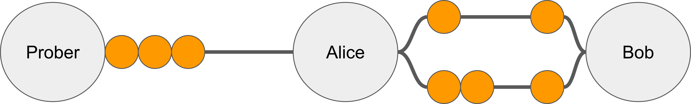
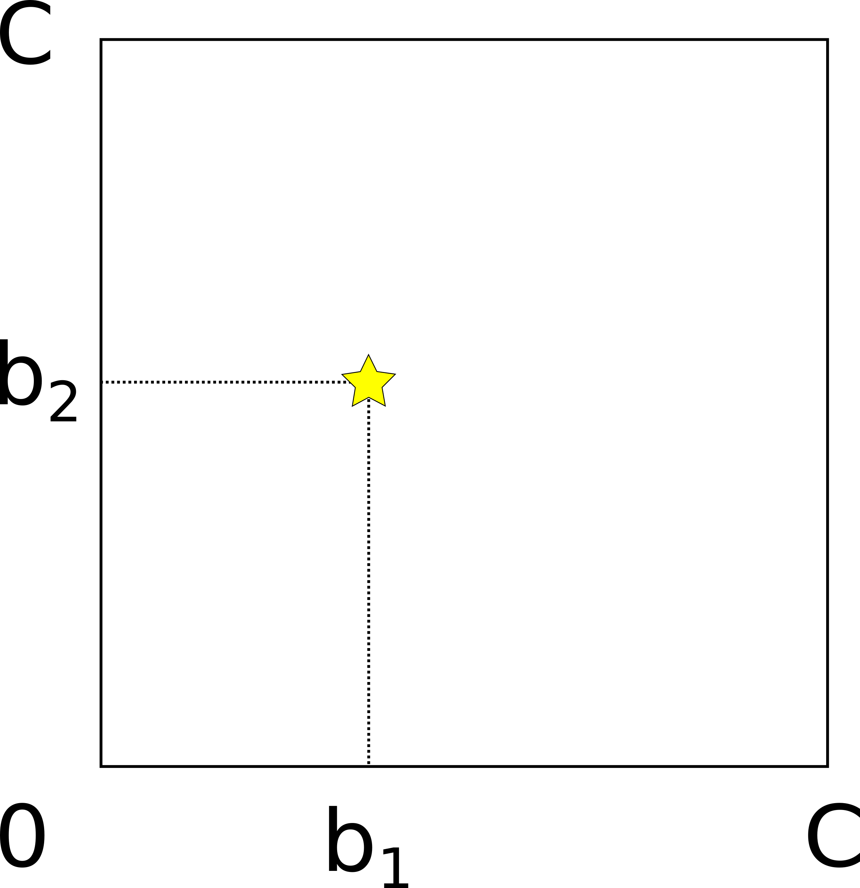
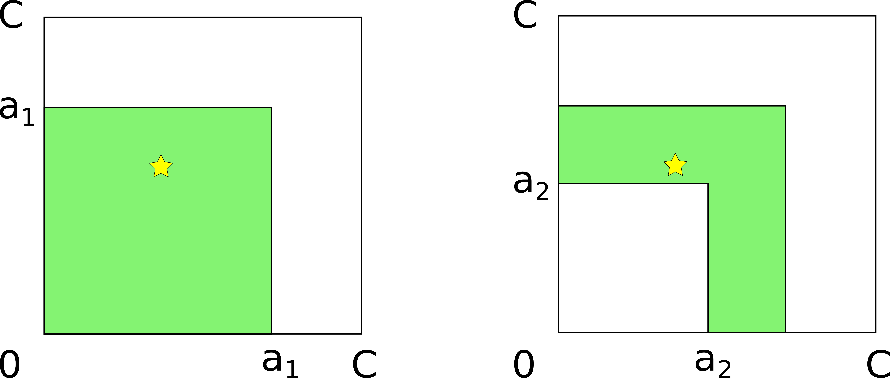
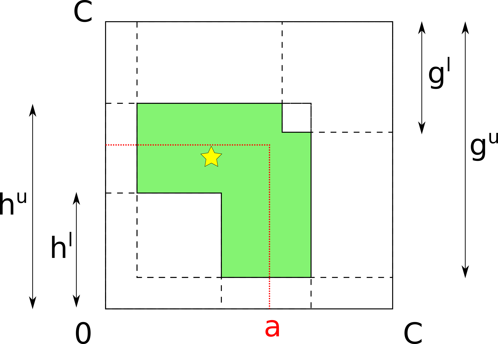
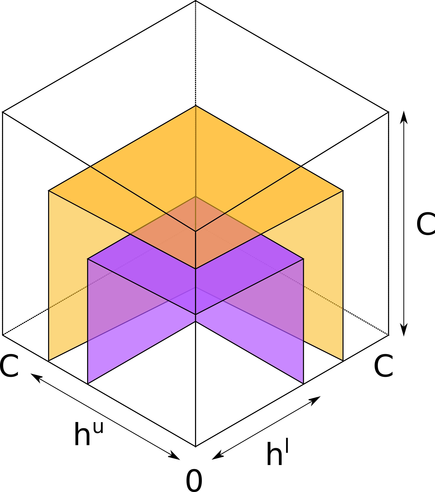
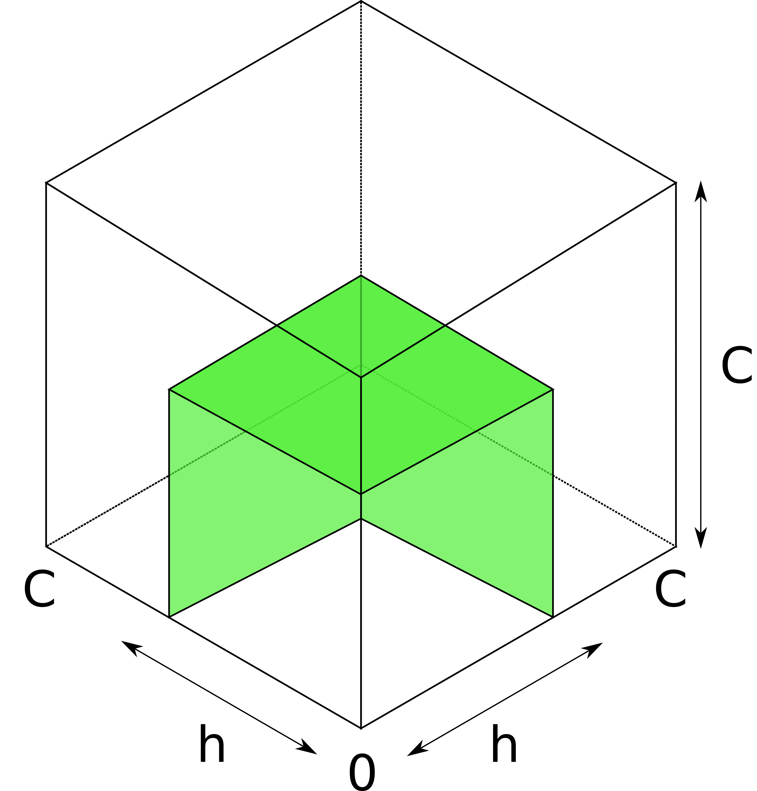
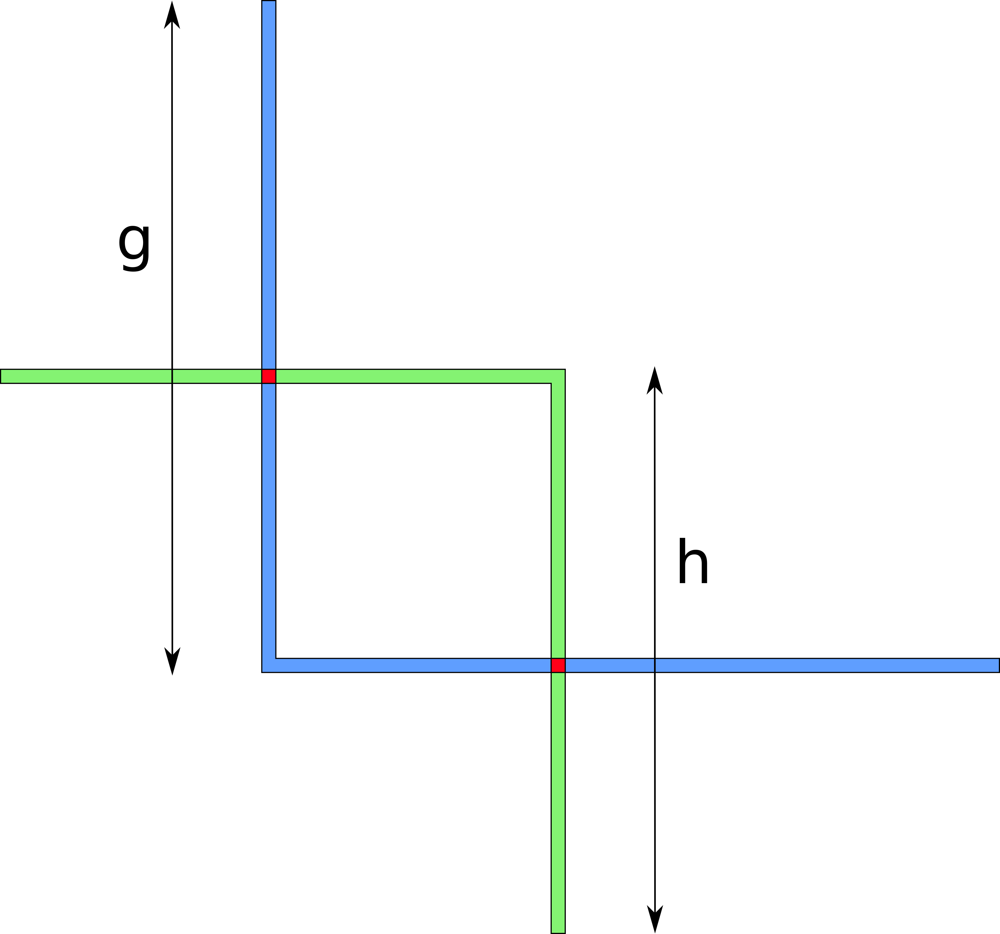
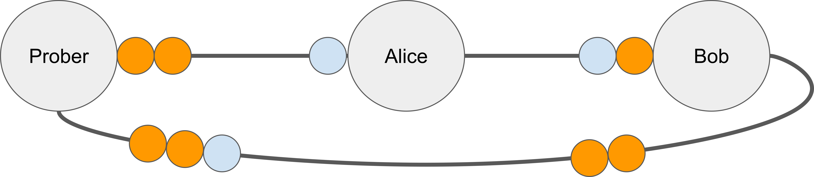

<!-- CHANGE PUBLISHED TO FALSE TO PUSH AS DRAFT -->
<!-- CHANGE DATE BEFORE PUBLICATION -->

# Intro

In this post, we summarize [our paper](https://eprint.iacr.org/2021/384) on channel balance probing in the Lightning network.

A video presentation based on this post:

<iframe width="560" height="315" src="https://www.youtube-nocookie.com/embed/ZiD7NqQ1YZc" frameborder="0" allow="encrypted-media" allowfullscreen></iframe>

First, we briefly introduce the Lightning network (LN) and the channel balance probing attack. Then, we propose an enhanced probing technique that allows an attacker to extract more private information faster. We run simulations based on real-world data and conclude that the proposed probing method is indeed better than prior art. Finally, we discuss potential countermeasures and their trade-offs.

1. [Lightning Network 101](#lightning-network-101)
2. [Channel balance probing](#channel-balance-probing)
3. [Probing model](#probing-model)
4. [Probing multi-channel hops](#probing-multi-channel-hops)
5. [Jamming-enhanced probing](#jamming-enhanced-probing)
6. [Evaluation](#evaluation)
7. [Conclusion](#conclusion)

# Lightning Network 101

The Lightning Network (LN) is a layer-two protocol for fast bitcoin payments. It is considered the major scaling solution for Bitcoin. As of December 2021, is consists of nearly 17 thousand nodes and nearly 78 thousand payment channels.

A payment channel is a cryptographic protocol for off-chain bitcoin payments between two parties. A useful mental model to visualize a channel is "beads on a string". The beads cannot leave the string, they can only move back and forth.

The total number of coins in a channel is called its _capacity_, and the number of coins currently owned by Alice and Bob are their respective _balances_. The two balances sum up to the capacity, so we can infer one balance from the other. We define the _channel_ balance to be the balance of the node with alphabetically smaller name (in this example, that would be "Alice"). We refer to a pair of adjacent nodes together with all channels that they share as a _hop_.

Alice doesn't have to establish a direct channel to Charlie to send him payments. Instead, she can use a multi-hop path (in this example, via Bob). Multi-hop payments work as follows. Alice offers Bob one coin under the condition that he forwards one coin to Charlie. Bob forwards the coin to Charlie, who uses the payment secret known only to him to redeem the coin. Bob can then use the same secret to redeem the coin from Alice. Hence, one coin has effectively moved from Alice to Charlie.

The key issue with this process is that Alice doesn't know in advance whether Bob has sufficient balance in the channel towards Charlie. If Alice tries to send another coin along the same path, the payment would fail. Therefore, Lightning follows the trial-and-error approach. The sender may have to make several payment attempts until one of them succeeds.

As we will see, one can exploit the error reporting mechanism of the Lightning network in an attack called balance probing.

# Channel balance probing

The attacker (also referred to as the Prober) wants to learn remote channels balances (which is private information). To achieve this goal, it sends fake payments, or _probes_, and observes where they fail. If a probe reaches the final destination, all channels along the path have sufficient balances. Otherwise, if the probe fails somewhere along the path, the Prober learns that the erring node lacks balance.

The attacker's knowledge may be visualized as follows. The outer interval denotes the target channel. The star shows the true balance. The colored area is the set of all points where, according to the attacker's current knowledge, the balance may be. b^l and b^u are the current balance bounds.

Initially, the colored area covers the whole interval. By making a series of probes, the attacker updates the balance estimates and shrinks the colored interval. Assuming that balances are equally likely to take any value between zero and the channel capacity, the optimal strategy is to divide the colored interval in half with every probe.

The probing algorithm doesn't always work perfectly. Consider a hop with two channels. Such channels are called _parallel_.

A routing node (Alice) is free to choose any of the parallel channels to forward the probe. After receiving the error message, the attacker doesn't know which channel it applies to. As a result, the classic probing algorithm becomes inapplicable.

Note that while the prober cannot update _individual_ balance bounds, it does get some information about the hop as a whole. We need a new probing model to describe what exactly the attacker learns in this case.

# Probing model

We propose a new geometrical model that describes probing in the general case, for any number of parallel channels. To introduce our model, let's use a two-dimensional example. Consider a two-channel hop with the capacities of both channels equal to C. It can be represented as a square with corners (0,0), (0,C), (C,C), (C,0).

Each point within the square corresponds to a possible vector of channel balances. The star denotes the true balance point: the first channel has balance b_1, and the second channel has balance b_2.

The attacker sends the first probe of amount a_1 that doesn't reach the destination.

This means that _all_ channel balances are less than the probe amount: b_1 < a_1 and b_2 < a_1. Geometrically, this means that the true balance is _inside_ the a_1-sided square that the probe "cuts" from the lower-left corner of the larger square. Now, the attacker sends another probe with amount a_2 that does reach the destination. This means that _at least one_ of the channels has sufficient balance: either b_1 > a_2 or b_2 > a_2. Geometrically, it means that the true balance is _outside_ of the a_2-sided square. As a result of there two probes, the attacker has obtained the upper and lower bounds that correspond geometrically to the colored L-shaped figure (the difference of two squares).

What do these bounds bound, by the way? As mentioned before, the prober doesn't necessarily learn something about individual balances. Instead, it learns how much a hop can forward in the probe direction -- simply speaking, the maximum of the balances. We refer to this value as h = max(b_i). The analogous value in the opposite direction is denoted as g.

Probes in the opposite direction have a similar representation in the geometrical model: instead of "cutting" squares from the lower-left corner from the larger square, they cut squares from the upper-right corner. Consider the state of probing after four probes have been done:

The attacker's knowledge is comprised of four values -- the lower and upper bounds on h and g. The bounds on h -- h^l and h^u -- define an L-shape "looking north-east", whereas g^l and g^u define an analogous L-shape "looking south-west". The intersection of these shapes defines the attacker's knowledge: the smaller the area of the resulting figure, the more precisely the prober knows there the true balances are.

Here is where our first contribution comes in. We suggest choosing each next probe amount such as the probe cuts the colored figure in half by area. Prior algorithms chose the probe amount as the mid-point between the current balance estimates, which may be sub-optimal in the multi-channel case. Instead, our generalized approach is optimized for hops with any number of channels.

The following figures illustrate the process of probing a 2-channel hop step by step. (We only go through the first four steps explicitly.)

Note that at some point the colored area splits into two disjoint diagonally symmetric rectangles. This is a representation of the fact that balances can only be probed up to permutation, because the model assigns channels to axes randomly.

The same model naturally applies to any number of channels (and therefore, dimensions).

Now consider a question. Given enough probes, can the attacker probe any hop, with any number of channels?

# Probing multi-channel hops

Consider a 3-channel hop with equal-capacity channels.

Analogously to the two-dimensional case, each probe now cuts a _cube_ (instead of a square) from the lower-left vertex of the larger _cube_ that represents the hop. The two bounds on h correspond to two surfaces, each composed of three perpendicular faces of the respective cube. The true balance must be above the smaller (purple) surface representing the lower bound, and below the larger (orange) surface representing the upper bound.

What happens when the attacker learn h precisely? The two surfaces collapse into one:

The balance must be somewhere _on_ the colored surface.

Probes from the opposite direction produce a symmetrical surface, also composed of three perpendicular squares. The true balance must be somewhere on the intersection of these two surfaces. However, in the general case, two such _surfaces_ intersect along a _line_ composed of six intervals. The attacker cannot learn exactly where on this line the balance is! Compare it to the two-dimensional case, where instead of surfaces we had linear L-shapes, which neatly intersected at exactly two points, reflecting the true balance vector (modulo permutation).

An intuitive interpretation of this difference could be as follows. There are only two directions that a channel can be probed in. Probing in each direction decreases the dimensionality by one. That is, if the hop in question has only one or two channels, the final result would only contain one or two points. In the 3-dimensional case, the best the attacker can achieve is a _line_, that is, a one-dimensional figure. In the 4-dimensional case, the end result would be some _surface_, in the 5-dimensional case -- some 3-dimensional _volume_, and so on.

(There is another scenario when a multi-channel hop may not always be probed fully. Can you guess what the reason is? If you want the answer, see Appendix B in the paper.)

The key issue that prevents full information extraction is that the prober cannot influence which of the parallel channels the probes go through. Instead, probes only reveal information about the _aggregate_ of the balances. If only there were a way to force probes go through a specific channel...

# Jamming-enhanced probing

We suggest combining jamming with probing to extract more information from multi-channel hops.

Jamming is a type of denial-of-service attacks on Lightning channels. The attacker sends a payment to itself (either via a circular route or simply to another node that it also controls) and deliberately delays finalizing the payment. As a result, the funds along the route are left "in-flight" and are unavailable for other payments.

There are two types of jamming (by capacity and by slots), discussing them is outside the scope of this post (please refer to the paper and references therein). For our purposes, it's sufficient to understand that an attacker can temporarily disable a victim channel.

We suggest combining jamming and probing to overcome the dimensionality issue described above. In particular, the attacker can jam all channels in a multi-channel hop except one, and then probe the remaining channel. In other words, while the attacker cannot influence how a routing node chooses a channel to forward a probe, it is possible to decrease the set of _suitable_ channels the node picks from.

Geometrically, jamming-enhanced probing boils down to revealing each channel individually. In the 3-dimensional case, the prober first reveals b_1, then b_2, and then b_3. Each balance is represented by a plane parallel to the corresponding axis. The intersection of three perpendicular planes is a single point representing the true balance vector.

To recap: our contributions are as follows. We introduce a new probing model that accurately describes the attacker's knowledge when probing multi-channel hops. We propose jamming-enhanced probing to overcome the limitation on information extraction in multi-channel hops. Finally, we suggest using an optimized algorithm (generalized binary search) to select probe amounts for multi-channel hops.

The question now is: how do we measure the benefits that our proposed improvements provide?

# Evaluation

We evaluate our approach using our own simulator written in Python. We capture a snapshot of the network using our own Lightning node and assign balances to channels uniformly at random. We then pick 20 target hops with a given number of channels (from 1 to 5) and probe them.

We use two metrics to access the success of the attack: information gain and probing speed. Information gain reflects the share (from 0 to 1) of uncertainty on balances in target hops that the attacker was able to resolve. (By uncertainty we mean the binary logarithm of the number of points contained in the figure describing the attackers knowledge after the final probing step.) Probing speed shows how much information the prober gets per message sent (a message is either a probe of a jam).

We alter the probing algorithm in three ways:

- Jamming-enhanced probing vs non-enhanced probing
- Optimized amount selection vs simple binary search
- Direct vs remote probing

In direct probing, the attacker established a channel to the target hop directly. In the real network, this requires on-chain fee but, on the other hand, all probes reach the target hop. In remote probing, the attacker sends probes along multi-channel paths. This allows for amortizing the cost of channel openings along many target hops but some probes are wasted due to insufficient balances in intermediary hops.

For each alteration of the probing algorithm, we run the simulation 100 times and average the results.

For information gain, we observe that:
1. for non-enhanced probing (the left graph), the information gain decreases as the number of channels increases (due to the dimensionality issue);
2. jamming-enhanced probing (the right graph) overcomes this limitation, achieving nearly full information extraction for multi-channel hops;
3. all else equal, remote probing performs slightly worse than direct probing due to routing issues.

For probing speed, we observe that:
1. Direct probing with optimized amount selection (the left graph, blue line) achieves nearly perfect probing speed of 1 bit / message;
2. Remote probing is always slightly slower than direct probing;
3. Optimized amount selection is always better than non-optimized amount selection.

In summary: we confirm that jamming-enhanced probing yields more balance information, and that optimized amount selection allows for doing it faster.

Potential countermeasures may be divided into node-level policies (something a single node can apply) or network-level protocol changes. On the node level, popular routing nodes may batch payments (so that payments in the opposite directions cancel each other out), split payments among their parallel channels, establish unannounced channels in parallel to public ones, or drop or forge error messages (which would, however, decrease reliability). Measures on the network level largely intersect with [potential anti-jamming proposals](https://blog.bitmex.com/preventing-channel-jamming/).

# Conclusion

In summary, we have introduced an enhanced probing technique for Lightning channels and confirmed using simulations that it reveals channel balances better and faster.

More generally, the issue we've been discussing illustrates the dilemma for Lightning. As long as Lightning is permissionless and privacy-focused (in particular, it uses onion routing), bad actors would be able to abuse it by mounting attacks on reliability (such as jamming) or privacy (such as probing). The key challenge in the development of the LN is to limit the negative effects of unwanted network activity while preserving the permissionless nature of the network. We hope this work helps advance the understanding of the relevant trade-offs and be a basis of future protocol improvements.

For more details, see the [full paper](https://eprint.iacr.org/2021/384) (to be presented at [Financial Cryptography 2022](https://fc22.ifca.ai/)). [Slides](https://docs.google.com/presentation/d/1IPZdpSVX2B636G6m4o66jQCk8RAO5HUy_HD_ITgR_-M/edit?usp=sharing) and a [video presentation](https://youtu.be/ZiD7NqQ1YZc) (roughly based on this post), and the [source code of the simulator](https://github.com/s-tikhomirov/ln-probing-simulator) are also available.

